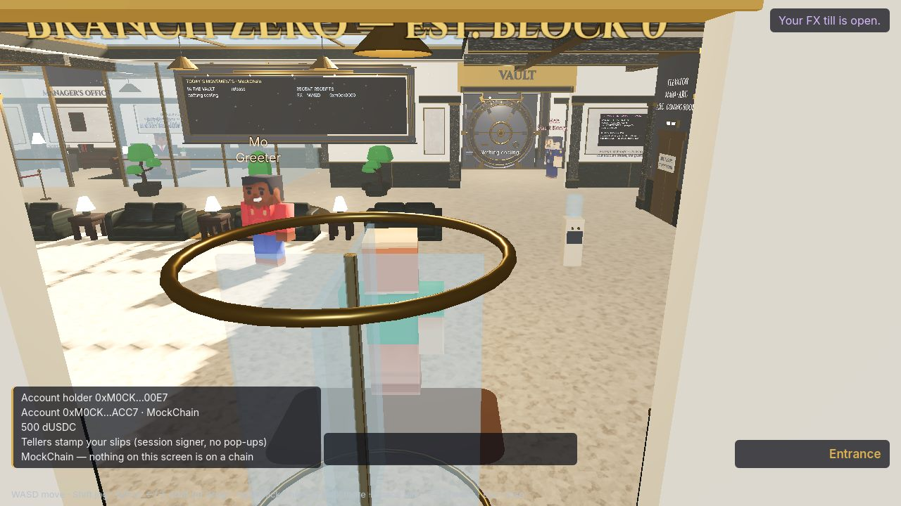
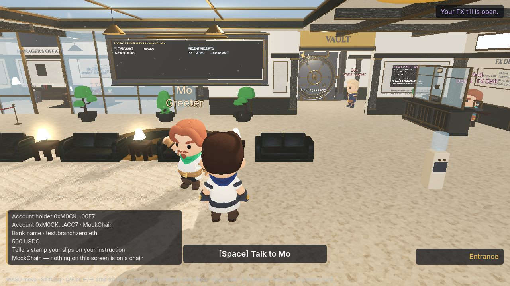
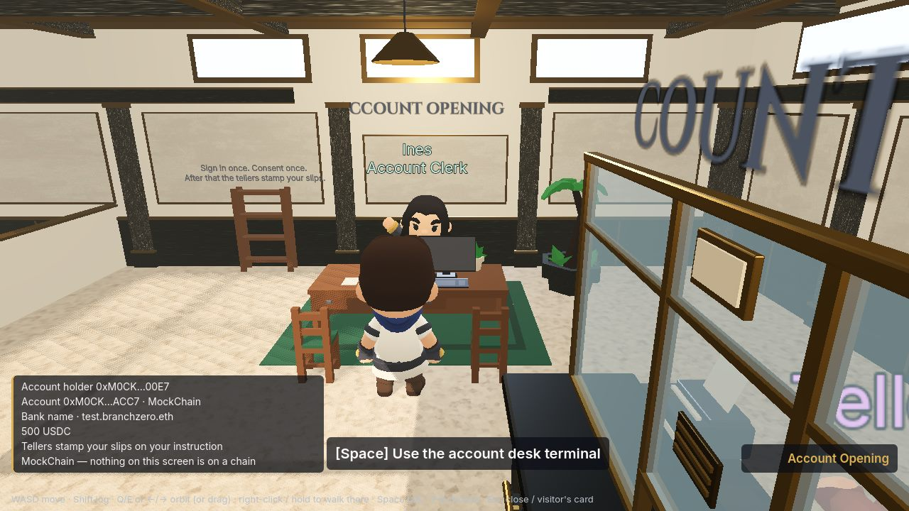
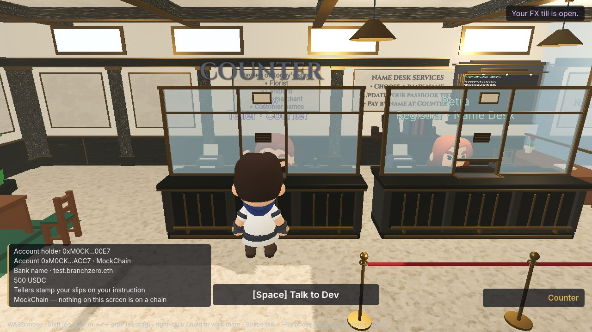
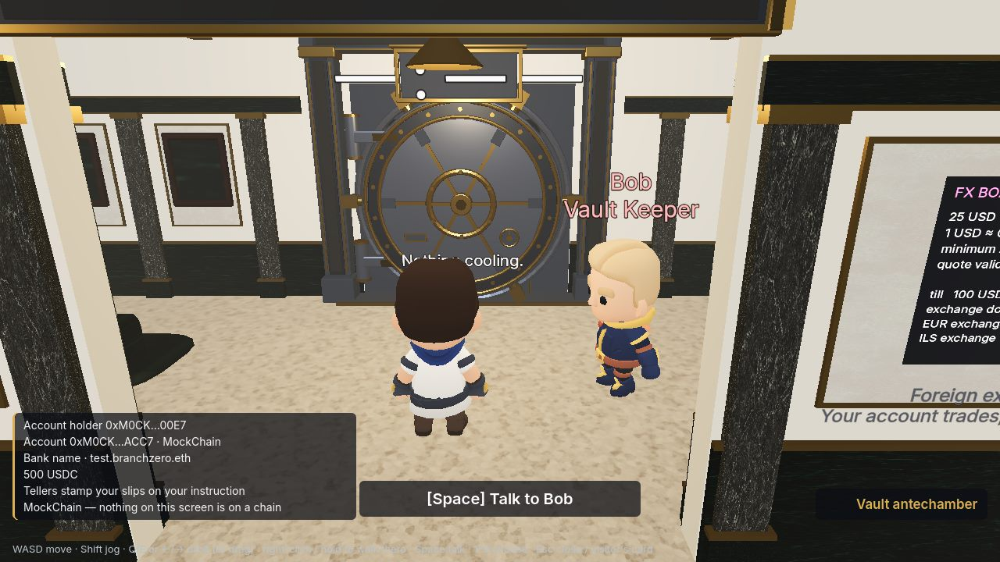
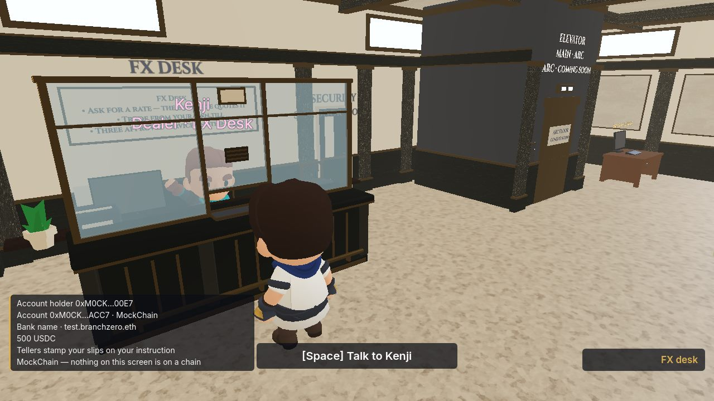
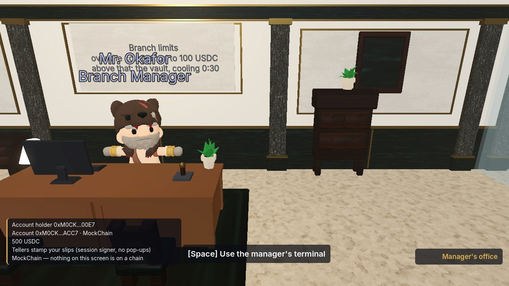
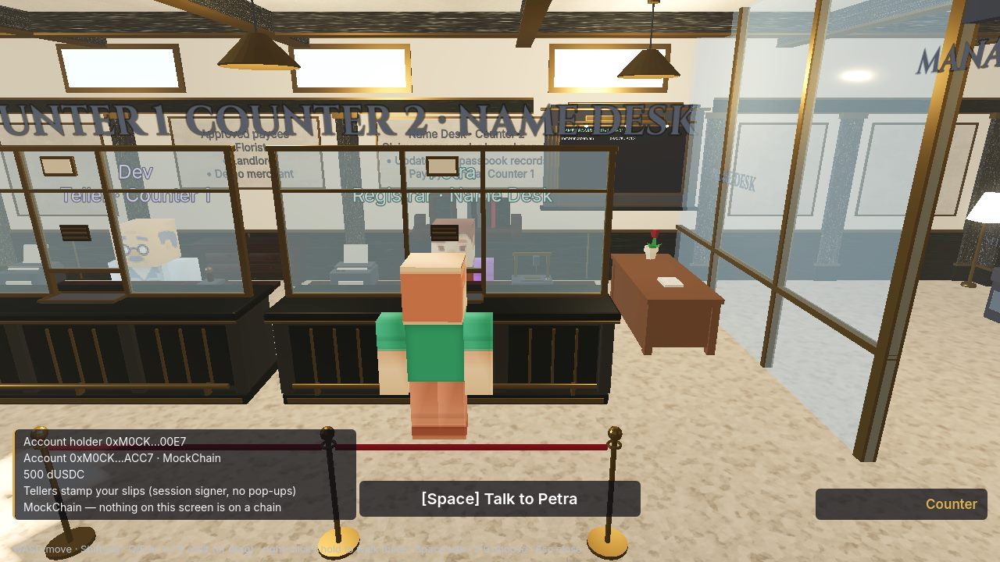

# Branch Zero

**A walkable 3D bank where every desk is a real smart-account operation.**

Built in Godot 4.5 for the browser. You do not click “Confirm” in a wallet pop-up — you talk to a teller. Under the floorboards: [Bloxchain](https://github.com/PracticalParticle/Bloxchain-Protocol) governed accounts via the public **`@bloxchain/sdk`**, Privy session signers, ENSv2 names, and a Uniswap v4 FX desk — live on Sepolia.

For [ETHOnline 2026](https://ethglobal.com/events/ethonline2026) · Start Fresh.

---

## Screenshots

<p align="center">
  
  
</p>
<p align="center">
  
  
</p>
<p align="center">
  
  
</p>
<p align="center">
  
  
</p>

> Captures from the web build. Mock HUD appears in some shots; Live Main runs on Sepolia.

---

## The idea

Most crypto apps hide security behind a wallet modal. **Branch Zero makes the security the building.**

You are a new customer at the first branch of a bank that runs on public rails. Staff take the rules seriously and explain them cheerfully. Open an account, pay the florist, bounce a large wire into the vault, wait out the clock — or skip cooling with a hand scan at the manager’s desk — and leave with a receipt whose fine print is a block-explorer link.

Tone: *Papers, Please* procedure + *Animal Crossing* warmth. On screen, everyday bank language. Protocol jargon only if you **Ask why**.

Design pillars (see [`docs/GAME-DESIGN.md`](./docs/GAME-DESIGN.md)):

| Pillar | Meaning |
|--------|---------|
| **Process is the puzzle** | Bank procedure *is* the on-chain workflow. No fake mini-games. |
| **No pop-ups, ever** | One Privy consent at Account Opening. After that, tellers stamp slips. |
| **Honest theatre** | Boards, clocks, and balances are read from chain — not local fiction. |
| **Small, warm, legible** | One building, stylised low-poly cast, web single-thread budget. |

---

## How you play

The loop is errand-driven. The greeter (Mo) routes you; each desk is a real lane:

| Desk | Staff | What you do | What the chain does |
|------|-------|-------------|---------------------|
| **Account Opening** | Ines | Sign in once, consent once | Deploy your `AccountBlox`; Privy session signer + policy |
| **Counter** | Dev | Pay an approved payee | Lane A — instant meta-tx (`requestAndApproveExecution`) |
| **Vault** | Bob | Wait for the clock, then release | Lane B — time-locked wire; clock is `releaseTime` |
| **Manager** | Mr. Okafor | Hand-scan Priority, or shred | Skip cooling (meta-approve) or cancel while PENDING |
| **Name Desk** | Petra | Claim `you.branchzero.eth` | ENSv2 subname + passbook text records |
| **FX Desk** | Kenji | Ask for a rate, swap | Guarded Uniswap v4 — practice USD → EUR \| ILS |

Walk without an inbox: `http://localhost:5173/?mock=account`. Demo storyboard: [`docs/DEMO-SCRIPT.md`](./docs/DEMO-SCRIPT.md).

---

## Narrative

**Branch Zero — Est. Block 0.** A branch that treats smart-account security as furniture: rope queues, a departure board of today’s movements, a vault door whose light turns green only when the timelock says so.

| You meet | Role in the story | On-chain identity |
|----------|-------------------|-------------------|
| **Mo** | Greeter — routes your first errands | — |
| **Ines** | Opens your account; explains the one consent | Bank provisioner |
| **Dev** | Stamps routine slips at the counter | Broadcaster |
| **Bob** | Watches the vault clock with you | Timed release path |
| **Mr. Okafor** | Priority or shredder — never a second timed stamp | Branch manager role |
| **Petra** | Engraves your bank name | ENSv2 registrar |
| **Kenji** | Quotes and swaps at the FX desk | Guarded Universal Router calls |

Cast and dialogue rules: [`docs/NPCS.md`](./docs/NPCS.md) · World layout: [`docs/WORLD-3D-ENVIRONMENT.md`](./docs/WORLD-3D-ENVIRONMENT.md).

---

## Under the hood

Three runtimes, one contract per player, public packages only.

```text
Browser                         Server                         Chain
──────                          ──────                         ─────
Godot 4.5 (GDScript, web)       Teller Desk (Fastify)          Sepolia (Live Main)
  └─ never holds keys             ├─ Privy session-signer RPC    Remote EVM 1337 (Dev Mode)
Vite + React shell                ├─ broadcaster hot wallet      Arc Testnet (wing — deferred)
  └─ window.BranchZero            └─ SSE status / receipts
       @bloxchain/sdk · viem · Privy
```

| Layer | Choice | Why |
|-------|--------|-----|
| **Game** | Godot 4.5.x · GDScript · single-thread WebGL2 | Walkable bank in the browser; no C# on web export |
| **Shell** | Vite · TypeScript · React overlay | One Privy modal; canvas focus after overlays |
| **Bridge** | `window.BranchZero` | Godot never talks RPC; JS owns SDK reads + desk HTTP |
| **Accounts** | Bloxchain `AccountBlox` via `@bloxchain/sdk` | Timelock, RBAC, guard whitelists — the bank’s rules |
| **Identity** | Privy embedded wallet + session signer + policy | One consent; tellers stamp slips without pop-ups |
| **Names** | ENSv2 subnames | Your bank name resolves to your account |
| **FX** | Uniswap v4 (practice USD / EUR / ILS) | Swap is three whitelisted calls on *your* account |
| **Desk** | Node 20 · Fastify · SSE | Provision, pay, wire, approve, cancel, status |

Hard rules: Godot never holds keys. Product runtime is **public `@bloxchain/sdk` + `viem`** (plus Privy). No custom Solidity in this repo. Testnets + lab chain only.

Architecture diagrams and sequences: [`docs/ARCHITECTURE.md`](./docs/ARCHITECTURE.md).

---

## Status

MVP frozen (U4 / G5, 2026-09-07). Live Main payment wing on **Sepolia**; Remote EVM is **Developer Mode**. FX fiat desk live 2026-09-09. See [`docs/OWED.md`](./docs/OWED.md) for what’s open and parked.

---

## Run locally

**Requirements:** Windows, Node ≥ 20, Godot **4.5.2** standard (not mono).

```bash
npm install
cp .env.example .env          # see docs for Privy + chain vars

npm run export:web            # Godot → apps/web/public/game/
npm run dev:teller            # Live desk :8787 (Sepolia)
npm run dev:web               # http://localhost:5173
```

| Mode | How |
|------|-----|
| Mock walk (no chain) | `http://localhost:5173/?mock=account` |
| Live (Sepolia) | default — `npm run dev:teller` |
| Developer Mode (Remote EVM 1337) | `npm run dev:teller:dev` + `?mode=dev` |

Full setup (Godot templates, Remote EVM, bootstrap, kill tests): [`docs/README.md`](./docs/README.md) · [`docs/GODOT.md`](./docs/GODOT.md) · [`docs/SEPOLIA-LIVE.md`](./docs/SEPOLIA-LIVE.md).

```bash
npm -w apps/teller-desk run killtests -- --fresh   # K2 / K5 / Lane A
```

---

## Repo layout

```text
apps/game/          Godot 4.5 project (GDScript). chain.gd is the only JavaScriptBridge user.
apps/web/           Vite shell + React overlay + window.BranchZero
apps/teller-desk/   Fastify — Privy auth key, broadcaster, lanes, SSE
packages/shared/    Chains, deployments schema, bridge types, ABI fragments
infra/              Deployments, pool scripts, funding helpers
docs/               Plan, design, architecture, sponsor notes
docs/media/readme/  Screenshots used above
```

---

## Docs

| Start here | |
|------------|---|
| [`docs/PLAN.md`](./docs/PLAN.md) | Scope, gates, submission |
| [`docs/GAME-DESIGN.md`](./docs/GAME-DESIGN.md) | Player fantasy, loop, protocol ↔ desk map |
| [`docs/ARCHITECTURE.md`](./docs/ARCHITECTURE.md) | Layers, bridge, trust boundaries |
| [`docs/DEMO-SCRIPT.md`](./docs/DEMO-SCRIPT.md) | 3-minute video storyboard |
| [`docs/PRIVY.md`](./docs/PRIVY.md) · [`ENS.md`](./docs/ENS.md) · [`UNISWAP.md`](./docs/UNISWAP.md) | Sponsor surfaces |
| [`docs/REFLECTION.md`](./docs/REFLECTION.md) | Kill-test log and design review |

---

## Licence

MIT. Bloxchain SDK is MPL-2.0. KayKit Adventurers and related kit assets retain their upstream licences — see attributions in `apps/game/assets/`.
