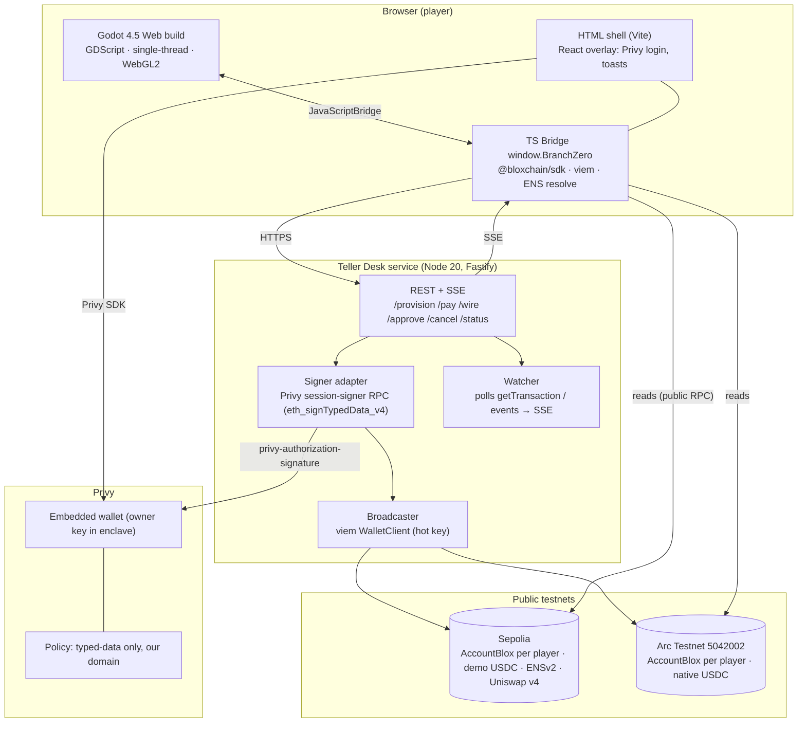
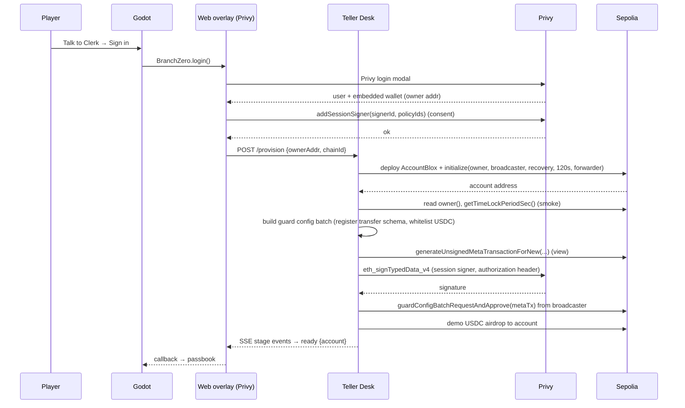

# Architecture — Branch Zero

> Three runtimes, one contract per player, only public `@bloxchain/*` packages. This document is also the source for the architecture diagram Arc requires in the submission.

Related: [BLOXCHAIN-INTEGRATION.md](./BLOXCHAIN-INTEGRATION.md) · [GODOT.md](./GODOT.md) · [PRIVY.md](./PRIVY.md) · [SECURITY-AND-KEYS.md](./SECURITY-AND-KEYS.md)

---

## 1. System overview



**Trust boundaries:** the browser never holds a private key. The Teller Desk holds (a) the Privy **authorization key** (P-256) that lets it *request* signatures from a wallet whose owner delegated to it, and (b) the **broadcaster** hot key that pays gas. Neither can move a player's funds alone: the enclave only signs typed data inside policy, and the broadcaster can only submit what the owner signed. On-chain, `AccountBlox` guards enforce target/selector whitelists and role permissions.

---

## 2. Components

### 2.1 `apps/game` — Godot project

- GDScript only. Autoloads: `GameState`, `Bridge`, `DialogueRunner`, `AudioBus`.
- `Bridge.gd` wraps `JavaScriptBridge.get_interface("BranchZero")`, converts JS promises to Godot signals, and exposes typed methods (`provision()`, `pay(recipient, amount, memo)`, `wire(...)`, `approve(tx_id)`, `cancel(tx_id)`, `resolve_name(name)`, `switch_wing(chain)`), plus a `status(event)` signal fed from SSE via a JS callback. See [GODOT.md](./GODOT.md) § Bridge contract.
- Never parses hex or ABI itself; everything arrives as plain JSON with display-ready fields.

### 2.2 `apps/web` — HTML shell + overlay + bridge (Vite + TypeScript + React)

- Hosts the exported Godot canvas (`index.html` from a custom Godot HTML template).
- React overlay (portal above canvas): Privy provider, login modal, session-signer consent, toasts, "copy hash".
- `bridge/` exposes `window.BranchZero` (see § 5): read-only chain calls with `@bloxchain/sdk` wrappers (`BaseStateMachine`, `GuardController`, `SecureOwnable`, `RuntimeRBAC`) over viem `PublicClient`, ENS resolution via viem, and thin HTTP client to the Teller Desk.
- Client-side signing fallback: if no session signer, `MetaTransactionSigner.signMetaTransactionWithWallet()` with the Privy-provided EIP-1193 provider wrapped as a viem `WalletClient`.

### 2.3 `apps/teller-desk` — Node service

- Fastify; endpoints in § 6. Holds env secrets (see [SECURITY-AND-KEYS.md](./SECURITY-AND-KEYS.md)).
- **Provisioner:** deploys `AccountBlox` (bytecode from `@bloxchain/contracts` artifacts) behind a minimal proxy or directly, calls `initialize(owner, broadcaster, recovery, timelock, eventForwarder)` in the same transaction where possible (factory pattern) or immediately after with a smoke read; runs the guard configuration batch; mints/airdrops demo USDC.
- **Signer adapter:** builds the EIP-712 payload (`META_TX_DOMAIN`, `META_TX_TYPES`, `buildTypedDataMessage`) and requests `eth_signTypedData_v4` via Privy's wallet RPC with the authorization signature header; verifies with `recoverAddress(digest)` against `metaTx.params.signer` before broadcasting.
- **Broadcaster:** `GuardController.requestAndApproveExecution(metaTx, {from: broadcaster})`, `executeWithTimeLock` (owner path via meta-tx or direct — see lane detail), `approveTimeLockExecution`, `cancelTimeLockExecution`, plus config batches.
- **Watcher:** per player, polls `getPendingTransactions()` + `getTransaction(txId)` every 4 s (or on new block via `watchBlockNumber`) and pushes normalised events over SSE.
- **Persistence:** SQLite (better-sqlite3) — `players(privyUserId, ownerAddress, accounts{chainId→address}, ensName, sessionSignerEnabled)`, `receipts(txHash, chainId, txId, lane, status)`. No secrets in DB.

### 2.4 `packages/shared`

- Zod schemas for API payloads; chain configs (`sepolia`, `arcTestnet` via `defineChain`); constants (demo USDC, definition library addresses, ENS parent name); error → bank-line mapping (`errors.json`) shared by game and server.

### 2.5 `infra/`

- Deploy scripts (`tsx`): `deploy-definitions.ts`, `deploy-account.ts`, `guard-config.ts`, `role-config.ts`, `ens-setup.ts`, `arc-smoke.ts`. All read from `.env`, write to `deployments/<chain>.json` (committed, addresses only).

---

## 3. Sequence diagrams

### 3.1 Account opening (M1)



### 3.2 Lane A — routine payment (M2)

```mermaid
sequenceDiagram
  participant G as Godot
  participant B as Bridge
  participant T as Teller Desk
  participant PR as Privy
  participant C as Chain

  G->>B: pay(recipient, amount, memo)
  B->>B: resolve ENS if name; validate address; amount ≤ instant limit?
  B->>T: POST /pay {account, to, amount, memo}
  T->>C: getSignerNonce(owner) · createMetaTxParams(handler=account, selector=requestAndApproveExecution, action=SIGN_META_REQUEST_AND_APPROVE, deadline, 0, owner)
  T->>C: generateUnsignedMetaTransactionForNew(owner, USDC, 0, gas, op=TOKEN_TRANSFER, sel=transfer, params(to,amount))
  C-->>T: unsigned metaTx (message digest)
  T->>PR: signTypedData(domain{chainId, verifyingContract=account}, META_TX_TYPES, buildTypedDataMessage(metaTx))
  PR-->>T: signature
  T->>T: recoverAddress(message) == owner ? else 400
  T->>C: requestAndApproveExecution(metaTx) from broadcaster
  C-->>T: tx hash → receipt (COMPLETED)
  T-->>B: SSE stages: signing → broadcasting → mined {hash, txId}
  B-->>G: receipt
```

### 3.3 Lane B — time-locked wire (M3)

```mermaid
sequenceDiagram
  participant G as Godot
  participant T as Teller Desk
  participant PR as Privy
  participant C as Chain

  G->>T: POST /wire {account, to, amount}
  Note over T: Request must come from OWNER (EXECUTE_TIME_DELAY_REQUEST).<br/>Path 1 (default): owner signs a meta-tx for executeWithTimeLock? — NOT a meta handler.<br/>Path 2 (chosen): grant a runtime role to the Teller Desk "requester" wallet with EXECUTE_TIME_DELAY_REQUEST on the transfer selector, so the Teller can *request* but never approve. VERIFY Day 3.
  T->>C: executeWithTimeLock(USDC, 0, transfer, params, gas, TOKEN_TRANSFER) from requester
  C-->>T: txId, status PENDING, releaseTime
  T-->>G: SSE pending {txId, releaseTime}
  loop every 4s
    T->>C: getTransaction(txId)
    T-->>G: SSE tick {status, releaseTime, now}
  end
  G->>T: POST /approve {txId}  (after release; owner or manager)
  alt owner via session signer
    T->>C: generateUnsignedMetaTransactionForExisting(txId, params(action=SIGN_META_APPROVE, handler=approveTimeLockExecutionWithMetaTx))
    T->>PR: signTypedData
    T->>C: approveTimeLockExecutionWithMetaTx(metaTx) from broadcaster
  else manager (T3)
    T->>C: approveTimeLockExecution(txId) from BRANCH_MANAGER wallet
  end
  C-->>T: COMPLETED
  T-->>G: SSE completed {hash}
```

Cancellation mirrors approval with `cancelTimeLockExecutionWithMetaTx` / `cancelTimeLockExecution`.

**Design note on Lane B request:** `executeWithTimeLock` is a direct call needing `EXECUTE_TIME_DELAY_REQUEST` permission for the selector; the owner's Privy wallet has no gas and we do not want a pop-up. Options, decided by the Day 3 kill test:
1. Fund the player's Privy wallet with a little testnet ETH at onboarding and let the **session signer send the transaction** (`eth_sendTransaction` in policy) — one extra policy rule, no pop-up, request truly comes from OWNER. **Preferred.**
2. Grant a `REQUESTER` runtime role to a Teller Desk wallet so the Teller can request but never approve/cancel (separation of duties still real).
3. Client-side pop-up for wires only (narratively acceptable: "big wires you sign yourself").

### 3.4 ENS pay-by-name (T1)

`resolve_name("bob.branchzero.eth")` → viem `getEnsAddress({ name, universalResolverAddress? })` on Sepolia (Universal Resolver default works for ENSv2 beta) → address → Lane A. Display name of a payee: viem `getEnsName` (reverse) with forward check enforced on-chain by ENSv2's Universal Resolver.

### 3.5 Wing switch (T2)

`switch_wing("arc")` → bridge swaps `PublicClient` + account address from `players.accounts[5042002]`; Teller Desk uses a broadcaster funded with faucet USDC on Arc; same lanes. If the player has no Arc account yet, the Clerk in the Arc wing provisions one (same provisioner, chainId param).

---

## 4. Data model (Teller Desk SQLite)

```sql
players(
  privy_user_id TEXT PRIMARY KEY,
  owner_address TEXT NOT NULL,
  session_signer INTEGER NOT NULL DEFAULT 0,   -- 1 if delegated
  ens_name TEXT,
  created_at INTEGER
);
accounts(
  owner_address TEXT, chain_id INTEGER, account_address TEXT,
  timelock_sec INTEGER, PRIMARY KEY(owner_address, chain_id)
);
receipts(
  id INTEGER PRIMARY KEY, owner_address TEXT, chain_id INTEGER,
  lane TEXT CHECK(lane IN ('A','B','CONFIG','ENS','FX')),
  tx_id INTEGER, tx_hash TEXT, status TEXT, payee TEXT, amount TEXT, memo TEXT,
  release_time INTEGER, created_at INTEGER, updated_at INTEGER
);
```

Chain remains the source of truth; the DB is a cache and an index of hashes for receipts.

---

## 5. `window.BranchZero` bridge contract (TS ↔ GDScript)

All methods return promises resolving to JSON-serialisable objects; the Godot side wraps them with `JavaScriptBridge.create_callback`. Amounts are decimal strings in display units; addresses are checksummed strings.

```ts
interface BranchZero {
  // session
  login(): Promise<{ userId: string; owner: string; signingMode: 'session'|'client' }>;
  logout(): Promise<void>;
  addSessionSigner(): Promise<{ ok: boolean }>;
  removeSessionSigner(): Promise<{ ok: boolean }>;

  // account
  provision(chainId: number): Promise<{ account: string; timelockSec: number }>;
  getPassbook(): Promise<{ owner: string; ensName?: string; chainId: number; account?: string;
                          balance: string; pending: number }>;
  switchWing(chainId: number): Promise<{ chainId: number; account?: string }>;

  // payments
  pay(to: string, amount: string, memo?: string): Promise<{ jobId: string }>;       // Lane A
  wire(to: string, amount: string, memo?: string): Promise<{ jobId: string }>;      // Lane B request
  approve(txId: string): Promise<{ jobId: string }>;
  cancel(txId: string): Promise<{ jobId: string }>;

  // reads
  listPending(): Promise<Array<{ txId: string; payee: string; amount: string; status: string; releaseTime: number }>>;
  listHistory(limit: number): Promise<Array<{ txId: string; status: string; type: string; hash?: string }>>;
  approvedPayees(): Promise<Array<{ address: string; name?: string }>>;
  serviceMenu(): Promise<Array<{ selector: string; operationName: string }>>;
  chainTime(): Promise<number>;

  // ens
  resolveName(name: string): Promise<{ address?: string }>;
  claimName(label: string): Promise<{ jobId: string }>;
  setRecord(key: string, value: string): Promise<{ jobId: string }>;

  // fx (stretch)
  quote(amountIn: string): Promise<{ amountOut: string }>;
  swap(amountIn: string): Promise<{ jobId: string }>;

  // events (SSE → Godot callback)
  onEvent(cb: (e: BridgeEvent) => void): void;
}

type BridgeEvent =
  | { type: 'stage'; jobId: string; stage: 'signing'|'broadcasting'|'mined'|'failed'; hash?: string; reason?: string }
  | { type: 'pending'; txId: string; releaseTime: number; payee: string; amount: string }
  | { type: 'tick'; txId: string; now: number; releaseTime: number }
  | { type: 'status'; txId: string; status: 'PENDING'|'COMPLETED'|'CANCELLED'|'FAILED'; hash?: string }
  | { type: 'wallet'; connected: boolean; owner?: string }
  | { type: 'error'; code: string; bankLine: string; technical: string };
```

Godot only consumes `bankLine` on the main path and `technical` under "Ask why".

---

## 6. Teller Desk API

| Method | Path | Body | Auth | Effect |
|--------|------|------|------|--------|
| POST | `/session` | `{ privyAccessToken }` | Privy JWT verify | upsert player |
| POST | `/provision` | `{ chainId }` | session | deploy + init + guard batch + airdrop; returns `jobId` |
| POST | `/pay` | `{ chainId, to, amount, memo }` | session | Lane A job |
| POST | `/wire` | `{ chainId, to, amount, memo }` | session | Lane B request job |
| POST | `/approve` | `{ chainId, txId, as: 'owner'|'manager' }` | session (manager requires role) | approve job |
| POST | `/cancel` | `{ chainId, txId, as }` | session | cancel job |
| GET | `/status` | — | session | passbook snapshot |
| GET | `/events` | — | session | SSE stream |
| POST | `/ens/claim` | `{ label }` | session | mint subname + records |
| POST | `/ens/record` | `{ key, value }` | session | delegated `setText` |
| POST | `/fx/swap` | `{ amountIn }` | session | guarded swap job |
| GET | `/healthz` | — | none | chains reachable, broadcaster balances |

Jobs are in-memory queues per player (p-queue) so one player's stuck tx does not block another. All handlers are idempotent on `(player, lane, clientNonce)`.

---

## 7. Configuration

```text
apps/teller-desk/.env
  PRIVY_APP_ID=
  PRIVY_APP_SECRET=
  PRIVY_AUTHORIZATION_PRIVATE_KEY=       # P-256, for session-signer requests
  PRIVY_SIGNER_ID=                       # key quorum id registered in dashboard
  PRIVY_POLICY_ID_TYPED_DATA=
  BROADCASTER_PRIVATE_KEY_SEPOLIA=       # throwaway
  BROADCASTER_PRIVATE_KEY_ARC=           # throwaway
  RECOVERY_ADDRESS=                      # Security Officer (cold, never used in demo unless S2)
  MANAGER_PRIVATE_KEY=                   # T3 demo manager (throwaway)
  DEPLOYER_PRIVATE_KEY=                  # deploys AccountBlox per player
  SEPOLIA_RPC_URL=
  ARC_RPC_URL=https://rpc.testnet.arc.io
  DEMO_USDC_SEPOLIA=                     # our own mintable ERC-20 or a public test USDC
  GUARD_DEFINITIONS_SEPOLIA= / RBAC_DEFINITIONS_SEPOLIA= / SECURE_OWNABLE_DEFINITIONS_SEPOLIA=
  GUARD_DEFINITIONS_ARC= / RBAC_DEFINITIONS_ARC= / SECURE_OWNABLE_DEFINITIONS_ARC=
  ENS_PARENT_NAME=branchzero.eth
  ENS_USER_REGISTRY= / ENS_RESOLVER= / ENS_REGISTRAR_PRIVATE_KEY=
  INSTANT_LIMIT_USDC=100
  TIMELOCK_SEC=120

apps/web/.env
  VITE_PRIVY_APP_ID=
  VITE_TELLER_DESK_URL=
  VITE_SEPOLIA_RPC_URL= / VITE_ARC_RPC_URL=
```

Public addresses are committed in `deployments/*.json`; secrets never are. See [SECURITY-AND-KEYS.md](./SECURITY-AND-KEYS.md).

---

## 8. Repository layout

```text
Branch-Zero/
├── README.md                 # pitch, diagram, code pointers, run, AI disclosure
├── LICENSE
├── CREDITS.md                # asset licences
├── FEEDBACK.md               # only if Uniswap S1 ships
├── docs/                     # this folder
│   └── progress/             # daily captures
├── apps/
│   ├── game/                 # Godot project (project.godot, scenes/, scripts/, dialogue/, assets/)
│   ├── web/                  # Vite shell + React overlay + bridge (window.BranchZero)
│   └── teller-desk/          # Node/Fastify service
├── packages/
│   └── shared/               # zod schemas, chain configs, constants, errors.json
├── infra/
│   ├── scripts/              # deploy-*.ts, guard-config.ts, role-config.ts, ens-setup.ts
│   └── deployments/          # sepolia.json, arc-testnet.json (addresses only)
├── package.json              # npm workspaces
└── .github/workflows/        # build web + teller-desk, export Godot (optional), deploy static
```

---

## 9. Deployment

- **Web build:** Godot export → `apps/web/public/game/`; Vite builds shell; deploy to Cloudflare Pages or GitHub Pages. Single-thread export needs no COOP/COEP. Serve `.wasm` with `application/wasm`, enable Brotli.
- **Teller Desk:** Fly.io / Railway / a small VPS; Node 20; SQLite volume; secrets via platform env. Single region is fine.
- **CORS:** Teller Desk allows the Pages origin only; SSE with credentials.
- **Health:** `/healthz` checks RPCs and broadcaster balances; the elevator says "closed for maintenance" when Arc fails.

---

## 10. Observability (minimal)

- Structured logs (pino) with `jobId`, `owner`, `chainId`, `txId`, `hash`.
- Every broadcast logged with explorer URL; every revert logged with decoded name via `decodeRevertReason`.
- `docs/progress/` daily captures double as evidence for judges.

---

## 11. Why this shape (short)

- **Contract per player** keeps the account pattern honest and demoable: judges can open the explorer and see *their* `AccountBlox`.
- **Server-side signing via Privy** is the only way to get "no pop-ups" without custodying keys; the enclave and the policy do the custody.
- **Godot as a pure view** means the game can be replaced by any client; nothing in Godot is security-relevant.
- **SSE over polling in the browser** keeps the single-threaded Godot main loop free.
