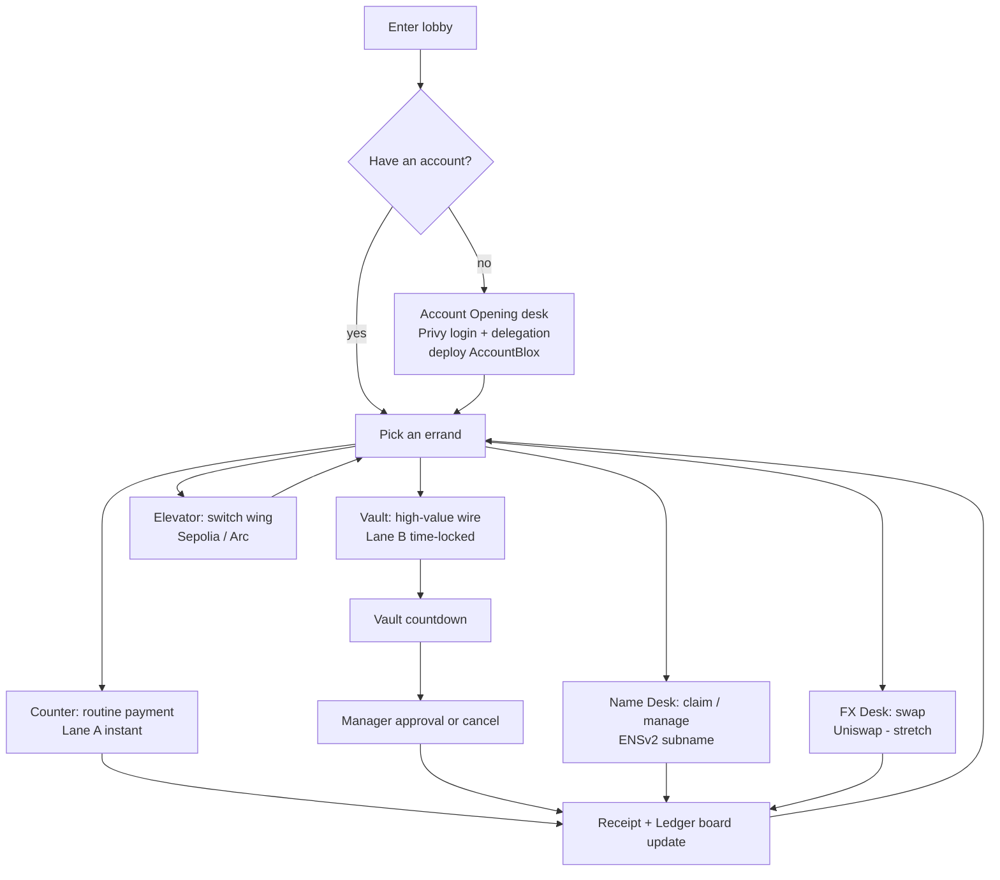

# Game Design — Branch Zero

> Design goal: a player with zero crypto knowledge should finish the 6-minute tutorial understanding, in their body, what a broadcaster, a timelock, an approval and a whitelist are — without ever reading those words on screen unless they ask the NPC.

Related: [PLAN.md](./PLAN.md) · [NPCS.md](./NPCS.md) · [WORLD-3D-ENVIRONMENT.md](./WORLD-3D-ENVIRONMENT.md) · [BLOXCHAIN-INTEGRATION.md](./BLOXCHAIN-INTEGRATION.md)

---

## 1. Design pillars

| Pillar | Meaning | Test |
|--------|---------|------|
| **Process is the puzzle** | The bank's procedure *is* the on-chain workflow. There are no fake mini-games; every friction the player feels is a real security property. | If a step could be skipped without changing chain state, cut it. |
| **No pop-ups, ever** | After the one-time delegation at Account Opening, the player never sees a wallet modal. Signing is diegetic: the teller stamps a slip. | Count modals in the demo video. Target: 1 (delegation). |
| **Honest theatre** | Everything the player sees is read from chain (statuses, countdowns, balances, names). If chain says PENDING the board says PENDING. | No local timers for release time; poll `getTransaction`. |
| **Everyday bank language first** | NPCs speak like bank staff. Protocol terms only appear in the optional "Ask why" dialogue branch and in the receipt's fine print. | On-screen copy uses bank words; technical terms stay in "Ask why" / fine print. |
| **Small, warm, legible** | One building, ~8 NPCs, 3D but stylised low-poly. Readability over fidelity; web single-thread budget. | 60 fps on an integrated GPU in Chrome. |

---

## 2. Player fantasy and framing

You are a new customer at **Branch Zero**, the first branch of a bank that runs on public rails. The bank is staffed by people who take rules seriously and explain them cheerfully. You open an account, make a payment, get bounced to the vault for a big wire, watch the vault timer, get the manager's stamp, and leave with a receipt whose fine print is a block explorer link.

Tone reference: *Papers, Please* procedural satisfaction + *Animal Crossing* warmth + a hint of *Wes Anderson* symmetry in the set design.

---

## 3. Core loop

The loop is errand-driven, not level-driven. The tutorial is simply the first errand of each type, gated by the Greeter.

---

## 4. Protocol-to-game mapping (the heart of the design)

| Bloxchain concept | Game element | Player-facing words | What is actually called |
|-------------------|--------------|---------------------|--------------------------|
| `AccountBlox` instance (owner = player) | **Your account** (passbook item in HUD) | "Your Branch Zero account" | Deployed at onboarding; address shown in passbook |
| `OWNER_ROLE` | You, the customer | "Account holder" | Player's Privy wallet |
| `BROADCASTER_ROLE` | **The Teller** (and their desk computer) | "Teller" | Teller Desk service hot wallet; executes `requestAndApproveExecution`, `approveTimeLockExecution` when signer-based |
| `RECOVERY_ROLE` | **Security Officer** at the side door | "Security" | Recovery wallet; `transferOwnershipRequest` (stretch S2) |
| Runtime role `BRANCH_MANAGER` (RuntimeRBAC) | **Branch Manager** in the glass office | "Manager sign-off" | `approveTimeLockExecution` / `cancelTimeLockExecution` permission on the wire selector |
| Meta-transaction (EIP-712 sign → broadcast) | **The slip**: you fill it, the teller stamps it | "Sign the slip" (automatic after delegation) | `generateUnsignedMetaTransactionForNew` → Privy session signer → `requestAndApproveExecution` |
| `requestAndApproveExecution` (instant) | **Counter lane** | "Over-the-counter payment" | Lane A |
| `executeWithTimeLock` (PENDING) | **Vault request**: the wire goes into the vault | "Scheduled wire" | Lane B step 1 |
| `releaseTime` / timelock | **Vault door countdown** (big analog clock + LED) | "Cooling period" | Read from `getTransaction(txId)` |
| `approveTimeLockExecution` | **Manager's stamp** (or your own at the vault window) | "Release the wire" | Lane B step 2 |
| `cancelTimeLockExecution` | **Shredder** at the manager's desk | "Recall the wire" | Lane B alt |
| Target whitelist per selector | **Approved payee list** on the teller's wall | "This branch only pays approved counterparties" | Guard config batch; `getFunctionWhitelistTargets` |
| Function schema / operation type | **Service menu** on the counter sign | "Services offered at this counter" | `getSupportedFunctions`, `getFunctionSchema` |
| `getPendingTransactions` / history | **Departure board** in the lobby | "Today's movements" | Ledger board |
| Revert / custom error | **Teller apology line** with a plain-English reason | "Sorry — that payee isn't approved." | `decodeRevertReason` → dialogue mapping |
| ENSv2 subname | **Your nameplate** at the Name Desk | "Your bank name: alice.branchzero.eth" | UserRegistry mint |
| ENSv2 text records | **Passbook fields** (tier, limit, role) | "Customer tier: Silver" | `setText` on PermissionedResolver |
| Enhanced Access Control delegation | **Teller may update your tier but not your address** | "Staff can only edit what they're allowed to" | `authorize*Roles` on resolver |
| Chain (Sepolia / Arc) | **Wing of the building** via elevator | "Main wing / Arc wing" | Bridge switches chain + account address |
| USDC as gas (Arc) | **"No fee jar"**: payments quoted in dollars | "Fees are in dollars here" | Arc native currency |

Rule: the **left column never appears on screen** by default. It appears in the "Ask why" branch and the receipt fine print.

---

## 5. Player journeys (tutorial errands)

### 5.1 Errand 0 — Open an account (M1)

1. Greeter NPC: "First time? Account Opening is the desk with the plant."
2. At the desk: **Login** (Privy modal — the only overlay of the game). Email / passkey / social.
3. Clerk explains in two lines: "We'll open your account, and you can let our tellers act on your instructions without you signing every slip. You can revoke that at any time at this desk."
4. **Delegation** step: Privy session-signer consent (this is the one wallet-side confirmation).
5. Loading animation: "Opening your account…" (deploy + initialise + guard config batch). Progress lines are real steps: *Creating account · Registering services · Approving payees · Ready.*
6. Passbook item appears in HUD with address, chain, balance (demo USDC minted/airdropped by the bank's faucet wallet).

Failure UX: if delegation is refused, the clerk says "No problem — tellers will ask you to sign each slip," and the bridge falls back to client-side `signTypedData` (K2 fallback).

### 5.2 Errand 1 — Pay the florist (Lane A)

1. Greeter: "Try paying the florist. Counter 1."
2. Counter 1 dialogue form: recipient (address, or name once ENS ships), amount, memo.
3. Amount ≤ branch instant limit (default 100 USDC) → Teller: "Over the counter, one moment."
4. Animation: teller types, stamp sound, printer. During this: sign (server) → broadcast → receipt on `COMPLETED`.
5. Receipt object: amount, payee, tx hash (copy), explorer link, and a fine-print line "Executed by Teller under your signed instruction (meta-transaction)".

### 5.3 Errand 2 — Wire the deposit on the flat (Lane B)

1. Amount > instant limit → Teller: "That's above what I can do here. It goes through the vault — there's a cooling period, then it needs a release."
2. Teller walks you (waypoint) to the Vault antechamber. `executeWithTimeLock` fires; the vault door clock starts from `releaseTime`.
3. Waiting is a design moment: the antechamber has a bench, a magazine ("Why do banks wait?" → optional lore about timelocks), and the Ledger board is visible.
4. On release: door light turns green. Two ways to finish:
   - Walk to the Vault window: "Release my wire" (owner approval).
   - Or ask the Branch Manager (if role T3 shipped) to stamp it.
5. Alternative: at any time before release, the Manager's shredder cancels the wire.

### 5.4 Errand 3 — Claim your name (ENS, T1)

1. Name Desk clerk: "Want people to pay you by name? Pick one." Availability check live against the UserRegistry.
2. Mint `alice.branchzero.eth` → resolver record `addr` = your account address; text `bz.tier=Silver`.
3. Return to Counter 1 and pay `bob.branchzero.eth` — the teller resolves it in front of you.
4. Optional: watch the Teller update your tier (delegated record right) but fail to change your address (no right) — a scripted moment that demonstrates EAC.

### 5.5 Errand 4 — Take the elevator (Arc, T2)

1. Elevator panel: "Main wing (Sepolia)" / "Arc wing".
2. In the Arc wing the counters quote fees in dollars; a wall poster explains "Here the network fee is paid in USDC."
3. Repeat Errand 1 on Arc.

### 5.6 Errand 5 — FX Desk (Uniswap, S1)

Swap 10 USDC → WETH via the guarded router call; a ticker board shows the quote before and the result after.

---

## 6. Rules, limits and difficulty knobs

| Knob | Default | Where it lives |
|------|---------|----------------|
| Instant lane limit | 100 USDC | `apps/teller-desk` config **and** enforced by the Teller's refusal; on-chain the real control is which actions the owner permitted for the selector |
| Timelock | 120 s | `AccountBlox.initialize(..., timeLockPeriodSec)` |
| Approved payees | florist, landlord, demo merchant, player-chosen names | Guard whitelist per selector (USDC `transfer`) |
| Meta-tx deadline | 10 min | `MetaTxParams.deadline` |
| Max gas price | 0 (no cap) on testnets | `MetaTxParams.maxGasPrice` |

There is no fail state. The only "difficulty" is procedural: the bank refuses what the guards refuse, and explains why.

---

## 7. HUD and UI

- **Passbook (top-left):** name (ENS) or short address, wing/chain chip, USDC balance, pending count badge.
- **Interaction prompt (center-bottom):** `[E] Talk` / `[E] Use`.
- **Dialogue panel (bottom):** NPC portrait, 1–3 lines, choices. Includes a persistent **"Ask why"** choice that reveals the protocol explanation for the current step.
- **Forms:** amount + recipient + memo as a paper slip UI; recipient field accepts `0x…` or `*.branchzero.eth`.
- **Receipts:** collectible; opens a side panel with hash and explorer link; "Copy hash".
- **Toasts (top-right, overlay in HTML):** wallet connection state, chain switches, errors.
- **Ledger board:** in-world 3D mesh with a `SubViewport` texture rendering rows.

Accessibility: all text ≥ 16 px at 1080p, high-contrast option, no timed dialogue, controller + keyboard + mouse.

---

## 8. Feedback and juice

| Event | Visual | Audio |
|-------|--------|-------|
| Signature obtained | Teller's stamp slams, ink splash particle | Stamp thud |
| Broadcast sent | Receipt printer rolls | Dot-matrix printer |
| COMPLETED | Receipt tears off; board row flips to green | Split-flap clack |
| PENDING (timelock) | Vault clock hands animate; LED red | Low hum |
| Release time reached | LED green, door bolts retract | Heavy bolt |
| CANCELLED | Shredder eats the slip | Shredder |
| Revert | Teller shakes head; slip slides back | Soft buzzer |

---

## 9. Progression and achievements (light)

Achievements are local (saved in browser storage) and purely cosmetic: *First Account*, *Over the Counter*, *Patience* (waited a full cooling period), *Named*, *Two Wings*, *Recalled* (cancelled a wire), *FX Trader*. The Greeter comments on them.

---

## 10. Content checklist per zone

| Zone | NPC | Interaction | Reads | Writes |
|------|-----|-------------|-------|--------|
| Lobby | Greeter | Tutorial routing, achievements | account existence, pending count | — |
| Account Opening | Clerk | Login, delegation, revoke, faucet top-up | Privy user, `owner()` | deploy, guard config batch |
| Counter 1–2 | Teller | Payment form, pay-by-name | balance, whitelist, ENS resolve | Lane A meta-tx |
| Vault antechamber | Vault Keeper (or terminal) | Show pending, countdown, release | `getPendingTransactions`, `getTransaction` | Lane B request/approve |
| Manager's office | Branch Manager | Approve / cancel / explain limits | pending list, roles | approve / cancel |
| Name Desk | Registrar | Claim name, set tier, delegate | UserRegistry, resolver | mint, `setText`, EAC |
| Elevator | — | Switch wing | chain configs | — |
| FX Desk (stretch) | Dealer | Quote + swap | quote | guarded swap |
| Side door | Security Officer | Recovery lore / S2 | recovery address | S2 |

---

## 11. Out-of-scope design notes (for later)

Multiplayer branches with real other users as managers; a "compliance" NPC using ENS text records as allowlists; a mobile build; seasonal events keyed to real mainnet activity.
