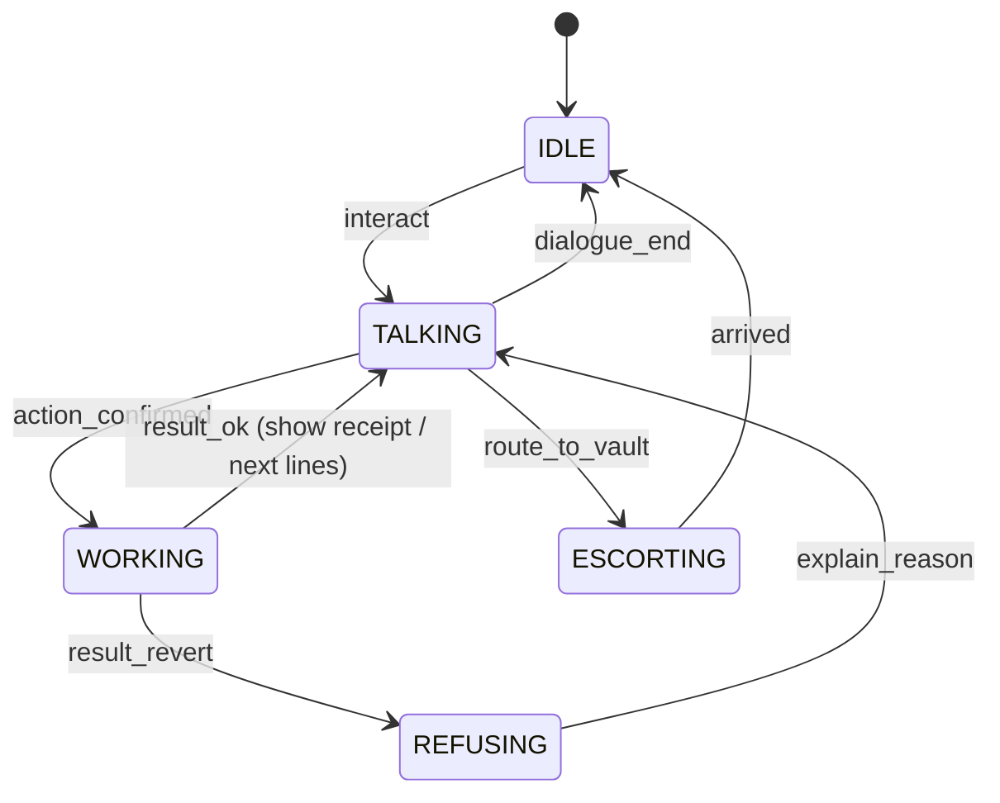

# NPCs — Staff of Branch Zero

> Every NPC embodies exactly one on-chain role or read surface. If an NPC does something the chain does not do, it is lore only and says so.

Related: [GAME-DESIGN.md](./GAME-DESIGN.md) § 4 mapping · [BLOXCHAIN-INTEGRATION.md](./BLOXCHAIN-INTEGRATION.md) · [WORLD-3D-ENVIRONMENT.md](./WORLD-3D-ENVIRONMENT.md)

---

## 1. Roster

| NPC | Zone | On-chain identity | Reads | Writes | Ships in |
|-----|------|-------------------|-------|--------|----------|
| **Greeter** (Mo) | Lobby | none | account existence, pending count, achievements | — | MVP |
| **Account Clerk** (Ines) | Account Opening | deployer wallet (bank) | Privy user, `owner()`, `initialized()` | deploy `AccountBlox`, guard config batch, faucet top-up | MVP |
| **Teller A** (Dev) / **Teller B** (Ama) | Counters | `BROADCASTER_ROLE` (Teller Desk hot wallet) | balance, whitelist, `getFunctionSchema`, ENS resolve | Lane A `requestAndApproveExecution`; Lane B `executeWithTimeLock` request | MVP |
| **Vault Keeper** (Ruth) | Vault antechamber | none (owner acts) | `getPendingTransactions`, `getTransaction` | owner `approveTimeLockExecution` (via signed meta-tx or direct) | MVP |
| **Branch Manager** (Mr. Okafor) | Manager's office | runtime role `BRANCH_MANAGER` | pending list, role membership | `approveTimeLockExecution`, `cancelTimeLockExecution` | T3 (MVP: lore + owner cancel) |
| **Registrar** (Petra) | Name Desk | bank's ENSv2 registrar key | availability, records | mint subname, `setText`, EAC delegation | T1 |
| **Dealer** (Kenji) | FX Desk | none | Uniswap quote | guarded swap | S1 |
| **Security Officer** (Sgt. Bale) | Side door | `RECOVERY_ROLE` | `getRecovery()` | `transferOwnershipRequest` | S2 (MVP: lore) |
| **Elevator voice** | Elevator | none | chain id | — | T2 |
| Ambient customers ×4 | Lobby | none | — | — | Day 8 |

Names are placeholders; keep them short and international.

---

## 2. Shared NPC architecture

```text
npc.tscn
├── CharacterBody3D
│   ├── MeshInstance3D (Quaternius humanoid)  + AnimationTree (idle / talk / type / stamp / walk / shake_head)
│   ├── CollisionShape3D
│   ├── Area3D "InteractZone"  → shows prompt, emits interact_requested(npc)
│   ├── Label3D "Nameplate"    → name + role (business words)
│   └── NavigationAgent3D      → only for escorts (Teller A)
└── NpcBrain (Node, script npc_brain.gd)
    ├── dialogue_id : StringName   → key into dialogue/*.json
    ├── state : NpcState           → IDLE | TALKING | WORKING | ESCORTING | REFUSING
    └── work_task : Callable       → async bridge call bound to this NPC
```

**State machine (all NPCs):**



`WORKING` plays the role's work animation (type/stamp) and shows a small progress line derived from the bridge's `stage` events (`signing → broadcasting → mined`). It never fakes progress: a stage only advances on a real event.

---

## 3. Dialogue system

- Format: JSON per NPC in `apps/game/dialogue/<npc>.json`, nodes with `id`, `lines[]`, `choices[]` (`text`, `next`, `action`), and `conditions` (`has_account`, `pending>0`, `wing==arc`, `ens_name!=null`).
- Runner: `DialogueRunner` autoload; supports `{vars}` interpolation from `GameState` (`{name}`, `{balance}`, `{limit}`, `{release_in}`).
- Every action node has a mandatory sibling choice **"Ask why"** → `why_*` node with the protocol explanation (technical terms allowed there).
- Revert mapping: `errors.json` maps decoded custom error names to NPC lines (see § 5).

Style guide: max 2 sentences per line; no jargon on the main path; humour dry, never mocking the player.

---

## 4. Per-NPC scripts

### 4.1 Greeter — Mo (Lobby)

Purpose: routing, tutorial pacing, celebration.

```text
[enter, no account]
Mo: Welcome to Branch Zero. First time? Account Opening is the desk with the plant — Ines will sort you out.
  > Where am I?            → lore_bank
  > Thanks.                → end

[enter, has account, pending == 0]
Mo: Morning, {name}. Counters are open, the vault's quiet. Try the florist — Counter 1.
  > What's the vault for?  → why_vault
  > Thanks.                → end

[enter, pending > 0]
Mo: You've got {pending} movement(s) cooling in the vault. Clock's on the wall — or bother Mr. Okafor.

[why_vault]
Mo: Big money doesn't move instantly here. It sits in the vault for a cooling period, then someone has to release it. If you didn't mean it, you can recall it before then.
  > Ask why (technical)    → why_vault_tech
[why_vault_tech]
Mo: Your account is a state machine. Large transfers are time-locked transactions: requested now, executable only after releaseTime, and cancellable until then.
```

### 4.2 Account Clerk — Ines (Account Opening)

Purpose: Privy login, delegation, account deployment, revoke, faucet.

```text
[no login]
Ines: Let's open your account. I'll need you to sign in — email, passkey, whatever you like.
  > Sign in                → action: privy_login
  > Ask why                → why_login

[why_login]
Ines: Signing in creates a wallet for you that you control. We never see the key; it lives in a secure enclave.

[logged in, no account]
Ines: One more thing. Would you like our tellers to act on your instructions without you signing every slip? You can revoke this here any time.
  > Yes, let tellers act for me   → action: privy_add_session_signer  (policy: bz-typed-data)
  > No, I'll sign each slip       → set signing_mode = client
  > Ask why                       → why_delegate

[why_delegate]
Ines: You'd be adding our branch as a signer on your wallet, limited by a policy to signing bank slips for your own account. Nothing else. Technically: a scoped session signer for eth_signTypedData_v4 on the Bloxchain EIP-712 domain.

[deploying]  (WORKING; progress lines are real stages)
Ines: Opening your account… Creating account · Registering services · Approving payees · Ready.

[done]
Ines: Done. Here's your passbook. Your account lives at {short_address} on the {wing} wing. I've put 500 practice dollars in it.
  > Revoke teller access   → action: privy_remove_session_signer
  > Top up practice dollars→ action: faucet
```

Bridge actions: `privy_login`, `privy_add_session_signer`, `provision_account` (deploy + init + guard batch), `faucet`, `privy_remove_session_signer`.

### 4.3 Tellers — Dev (Counter 1), Ama (Counter 2)

Purpose: payment intake, lane routing, execution (Lane A), request (Lane B), refusal with reasons.

```text
[idle]
Dev: Counter 1. Paying someone?
  > Make a payment         → form: payment_slip {recipient, amount, memo}
  > Who can I pay?         → list: approved payees (from whitelist + ENS names)
  > What services here?    → list: service menu (from function schemas)

[slip submitted, amount <= limit]
Dev: Over the counter — one moment.   (WORKING: type → stamp → print)
  stage signing:      "Stamping your slip…"
  stage broadcasting: "Sending…"
  stage mined:        "Done. Here's your receipt."
  > Ask why            → why_instant
[why_instant]
Dev: You signed the slip; I executed it. That's a meta-transaction: your signature authorises, my desk pays the gas and submits. It was approved and executed in one step because it's within your instant limit.

[slip submitted, amount > limit]
Dev: That's above what I can do here. It goes through the vault — there's a cooling period of {timelock} and then it needs a release. Walk with me.
  > OK                 → action: lane_b_request, then ESCORTING to vault
  > Ask why            → why_vault_route
[why_vault_route]
Dev: Large movements are requested now and executed later. Between the two, you or the manager can recall it. It's the same account, just a slower lane.

[revert]
Dev: Sorry — {reason_line}.
  > Ask why            → shows decoded error name + short explanation
```

Lane routing note: the **instant limit is a branch policy** enforced by the Teller Desk; the on-chain controls are the guards and which actions the owner has permission for. "Ask why" says this honestly.

### 4.4 Vault Keeper — Ruth (Vault antechamber)

Purpose: show pending wires, countdown, owner release.

```text
[pending > 0, before release]
Ruth: Wire #{txId} to {payee}, {amount}. Releases in {release_in}. Have a seat, or bother the manager if you want it recalled.
  > Ask why            → why_cooling
[why_cooling]
Ruth: The clock is the chain's clock, not mine. releaseTime is written into the transaction record; nobody here can shorten it.

[pending > 0, after release]
Ruth: #{txId} is ready. Say the word and it goes.
  > Release the wire   → action: lane_b_approve(txId)   (owner path)
  > Not yet            → end

[no pending]
Ruth: Quiet day. Nothing cooling.
```

### 4.5 Branch Manager — Mr. Okafor (Manager's office)

Purpose: approvals and cancellations with a distinct role; explains limits.

```text
[idle]
Okafor: Come in. Something in the vault needs a decision?
  > Approve a wire     → list pending (released only) → action: manager_approve(txId)
  > Recall a wire      → list pending → action: manager_cancel(txId)
  > Explain the limits → limits_poster
  > Ask why            → why_manager

[why_manager]
Okafor: I hold a runtime role — BRANCH_MANAGER — with permission to approve or cancel time-locked executions on this branch's transfer function. I cannot start a payment for you; I can only decide on one you started.

[T3 not shipped]
Okafor: (lore only) Today I'm just decoration — go release it yourself at the vault window.
```

### 4.6 Registrar — Petra (Name Desk) — T1

```text
Petra: Names! Pick one and people can pay you by it.
  > Claim a name       → form: name_claim {label} → availability check → action: ens_mint(label)
  > Update my tier     → action: ens_set_text("bz.tier", …)   (delegated to teller in the scripted demo)
  > Who's registered?  → board
  > Ask why            → why_ens
[why_ens]
Petra: You're getting a subname under branchzero.eth on ENSv2. Your name points at your account; your passbook fields are text records; the staff only get the rights the registry grants them.
```

### 4.7 Dealer — Kenji (FX Desk) — S1

```text
Kenji: Dollars for ether? Quote's on the board.
  > Swap {amount} USDC → action: fx_swap(amount)  (guarded router call)
  > Ask why            → why_swap
[why_swap]
Kenji: Your account calls the exchange router directly, but only because that router is on your approved list for that exact function. Same guard as payments.
```

### 4.8 Security Officer — Sgt. Bale (Side door) — S2 / lore

```text
Bale: Lost your key? That's what I'm for. Recovery can move the account to a new holder — after the cooling period, of course.
  > Ask why            → why_recovery
[why_recovery]
Bale: A separate recovery role can request an ownership transfer. It's time-locked like everything else, so the real holder can see it coming.
```

### 4.9 Elevator voice

```text
"Main wing — Sepolia."  /  "Arc wing — fees in dollars."
On failure: "Arc wing is closed for maintenance." (chain unreachable)
```

---

## 5. Revert → dialogue mapping (`errors.json`)

Decoded via the SDK's `decodeRevertReason` / `getUserFriendlyErrorMessage`, then mapped to a bank line. Unknown errors fall back to the SDK's friendly message.

| Decoded error (SDK name, indicative) | NPC line |
|--------------------------------------|----------|
| Target not whitelisted / `ResourceNotFound` on whitelist | "That payee isn't on our approved list." |
| Missing permission / role check | "You're not allowed to do that from this counter." |
| Timelock not expired | "Still cooling — {release_in} to go." |
| Invalid signature / signer mismatch | "That slip isn't signed by the account holder." |
| Deadline passed | "That slip expired — let's write a new one." |
| Insufficient balance (ERC-20) | "Not enough practice dollars in the account." |
| Nonce mismatch | "Someone already used that slip number — writing a fresh one." |

Populate the exact error names from `ERROR_SIGNATURES` in `@bloxchain/sdk` on Day 3 (`VERIFY`).

---

## 6. Animation set (Quaternius humanoid, retargeted)

| Clip | Used by | Trigger |
|------|---------|---------|
| Idle, IdleTalk | all | state |
| Type | Tellers, Clerk, Registrar | WORKING signing/broadcast |
| Stamp (custom, 0.6 s) | Tellers, Manager | signature obtained / approval |
| ShakeHead | all | REFUSING |
| Walk | Teller A | ESCORTING |
| Wave | Greeter | player enters lobby |
| Shred (arm motion) | Manager | cancel |

---

## 7. Ambient NPCs

Four customers on a looping `Path3D` between benches and counters; no interaction; disabled on low-end (draw-call budget). Occasionally play a canned line bubble ("Third time this week the vault's faster than my old bank.").

---

## 8. Acceptance

- [ ] Every action NPC has an "Ask why" branch with an accurate technical line.
- [ ] Every action shows real stage progress; no fake timers.
- [ ] Every revert seen in testing has a bank line in `errors.json`.
- [ ] Lore-only NPCs say so in their "Ask why" branch until their feature ships.
