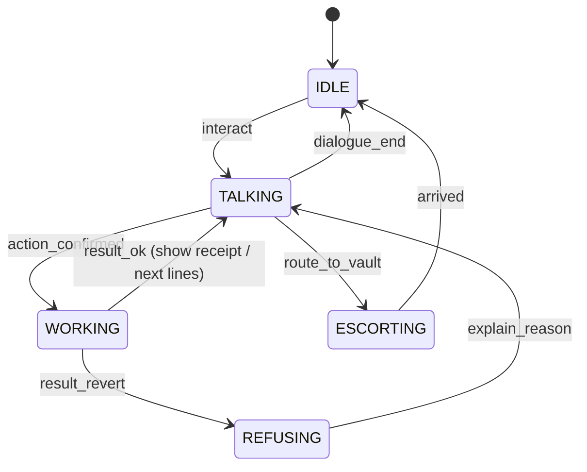

# NPCs — Staff of Branch Zero

> Every NPC embodies exactly one on-chain role or read surface. If an NPC does something the chain does not do, it is lore only and says so.

Related: [GAME-DESIGN.md](./GAME-DESIGN.md) § 4 mapping · [BLOXCHAIN-INTEGRATION.md](./BLOXCHAIN-INTEGRATION.md) · [WORLD-3D-ENVIRONMENT.md](./WORLD-3D-ENVIRONMENT.md)

---

## 1. Roster

| NPC | Zone | On-chain identity | Reads | Writes | Ships in |
|-----|------|-------------------|-------|--------|----------|
| **Greeter** (Mo) | Lobby | none | account existence, pending count, achievements | — | MVP |
| **Account Clerk** (Ines) | Account Opening | deployer wallet (bank) | Privy user, `owner()`, `initialized()` | deploy `AccountBlox`, guard config batch, faucet top-up | MVP |
| **Teller A** (Dev) / **Teller B** (Ama) | Counters | `BROADCASTER_ROLE` (Teller Desk hot wallet) | balance, whitelist, `getFunctionSchema`, ENS resolve | Lane A `requestAndApproveExecution`; Lane B `executeWithTimeLock` request | MVP |
| **Vault Keeper** (Bob — was Ruth until U7 polish) | Vault antechamber | none (owner acts) | `getPendingTransactions`, `getTransaction` | **Wait path:** owner timed `approveTimeLockExecution` **after** `releaseTime`, silent session signer | MVP; U4+ wait-only |
| **Branch Manager** (Mr. Okafor) | Manager's office | runtime role `BRANCH_MANAGER` | pending list (cooling vs ready), role membership | **Priority:** submits the owner's Passkey-signed `SIGN_META_APPROVE` via `approveTimeLockExecutionWithMetaTx` **before** the clock (`EXECUTE_META_APPROVE`); **recall** `cancelTimeLockExecution`. **No** post-clock timed stamp (removed in ROLE_SET 3) | U4+ **built 2026-09-07** |
| **Registrar** (Petra) | Name Desk — serves from the south teller bay; names board on the west wall | bank's ENSv2 registrar key | availability, records | mint subname, `setText`, EAC delegation | T1 |
| **Dealer** (Kenji) | FX Desk | none | Uniswap quote (USD → EUR \| ILS) | guarded swap | S1 · fiat pairs 2026-09-09 |
| **Security Officer** (Sgt. Bale) | Side door | `RECOVERY_ROLE` | `getRecovery()` | `transferOwnershipRequest` | S2 (MVP: lore) |
| **Elevator voice** | Elevator | none | chain id | — | T2 |
| Ambient customers ×4 | Lobby | none | — | — | Day 8 |

Names are placeholders; keep them short and international.

---

## 2. Shared NPC architecture

```text
npc.tscn
├── CharacterBody3D
│   ├── MeshInstance3D (Quaternius humanoid)  + AnimationTree (idle / talk / type / stamp / walk / shake_head)
│   ├── CollisionShape3D
│   ├── Area3D "InteractZone"  → shows prompt, emits interact_requested(npc)
│   ├── Label3D "Nameplate"    → name + role (business words)
│   └── NavigationAgent3D      → only for escorts (Teller A)
└── NpcBrain (Node, script npc_brain.gd)
    ├── dialogue_id : StringName   → key into dialogue/*.json
    ├── state : NpcState           → IDLE | TALKING | WORKING | ESCORTING | REFUSING
    └── work_task : Callable       → async bridge call bound to this NPC
```

**State machine (all NPCs):**



`WORKING` plays the role's work animation (type/stamp) and shows a small progress line derived from the bridge's `stage` events (`signing → broadcasting → mined`). It never fakes progress: a stage only advances on a real event.

---

## 3. Dialogue system

- Format: JSON per NPC in `apps/game/dialogue/<npc>.json`, nodes with `id`, `lines[]`, `choices[]` (`text`, `next`, `action`), and `conditions` (`has_account`, `pending>0`, `wing==arc`, `ens_name!=null`).
- Runner: `DialogueRunner` autoload; supports `{vars}` interpolation from `GameState` (`{name}`, `{balance}`, `{limit}`, `{release_in}`).
- Every action node has a mandatory sibling choice **"Ask why"** → `why_*` node with the protocol explanation (technical terms allowed there).
- Revert mapping: `errors.json` maps decoded custom error names to NPC lines (see § 5).

Style guide: max 2 sentences per line; no jargon on the main path; humour dry, never mocking the player.

---

## 4. Per-NPC scripts

### 4.1 Greeter — Mo (Lobby)

Purpose: routing, tutorial pacing, celebration.

```text
[enter, no account]
Mo: Welcome to Branch Zero. First time? Account Opening is the desk with the plant — Ines will sort you out.
  > Where am I?            → lore_bank
  > Thanks.                → end

[enter, has account, pending == 0]
Mo: Morning, {name}. Counters are open, the vault's quiet. Try the florist — Counter.
  > What's the vault for?  → why_vault
  > Thanks.                → end

[enter, pending > 0]
Mo: You've got {pending} movement(s) cooling in the vault. Clock's on the wall — or bother Mr. Okafor.

[why_vault]
Mo: Big money doesn't move instantly here. It sits in the vault for a cooling period, then someone has to release it. If you didn't mean it, you can recall it before then.
  > Ask why (technical)    → why_vault_tech
[why_vault_tech]
Mo: Your account is a state machine. Large transfers are time-locked transactions: requested now, executable only after releaseTime, and cancellable until then.
```

### 4.2 Account Clerk — Ines (Account Opening)

Purpose: Privy login, delegation, account deployment / **load by address**, revoke, faucet, and the desk terminal.

```text
[no login]
Ines: Let's open your account. I'll need you to sign in — email, passkey, whatever you like.
  > Sign in                → action: privy_login
  > Ask why                → why_login

[why_login]
Ines: Signing in creates a wallet for you that you control. We never see the key; it lives in a secure enclave.

[logged in, no account]
Ines: One more thing. Would you like our tellers to act on your instructions without you signing every slip? You can revoke this here any time.
  > Yes, let tellers act for me   → action: privy_add_session_signer  (policy: bz-typed-data)
  > No, I'll sign each slip       → set signing_mode = client
  > Ask why                       → why_delegate

[why_delegate]
Ines: You'd be adding our branch as a signer on your wallet, limited by a policy to signing bank slips for your own account. Nothing else. Technically: a scoped session signer for eth_signTypedData_v4 on the Bloxchain EIP-712 domain.

[open / no account on file]
Ines: Ready to open your account? …
  > Open my account        → action: provision (recover last clone or cloneBlox)
  > Load an existing account → form: load_account { account } → node `loading` → action: load_account
  > Ask why

[deploying]  (WORKING; progress lines are real stages)
Ines: Opening your account… Creating account · Registering services · Approving payees · Ready.

[done]
Ines: Done. Here's your passbook. Your account lives at {short_address} on the {wing} wing. I've put 500 practice dollars in it.
  > Re-check my account
  > Load an existing account → form: load_account { account }   (non-latest clone / multi-account)
  > Revoke teller access   → action: privy_remove_session_signer
  > Top up practice dollars→ action: faucet
  > Use the desk terminal  → action: open_console

[console_open]
Ines: Console is on the desk screen. Close the panel when you're done.
  > Done.                  → end
```

Bridge actions: `privy_login`, `privy_add_session_signer`, `provision_account` (deploy + init + guard batch), `load_account` (adopt an owned AccountBlox after the `owner()` check — bridge `loadAccount` → `POST /account/load`), `faucet`, `privy_remove_session_signer`, `open_console` (terminal only; viewing-wallet verbs remain at the terminal).

The desk terminal helps **discover** addresses; Ines **loads** them into the session. Auto-recovery still keeps the latest `BloxCloned` when the player chooses Open my account.

**As built (2026-09-08).** The load slip is `scripts/load_account_form.gd` (one LineEdit, 0x + 40 hex checked
locally and nothing else — whether an address is an account is the chain's answer, not the form's). It routes to
the `loading` node, whose `enter_action` runs `load_account`; on success Ines reads the `loaded` line, on refusal
the ordinary `refused` / Ask-why pair. Three refusals have their own bank lines: `ACCOUNT_NOT_OWNED` (the ledger
names someone else), `ACCOUNT_NOT_A_VAULT` (nothing of ours at that number on this wing — which is also what a
pasted address from the other wing looks like) and `LOAD_POLICY` (the signing rules could not be moved, so the
file was left alone). Evidence: [`progress/2026-09-08-load-account.md`](./progress/2026-09-08-load-account.md).

### 4.3 Tellers — Dev (Counter), Ama (second teller)

Purpose: payment intake, lane routing, execution (Lane A), request (Lane B), refusal with reasons.

```text
[idle]
Dev: Counter. Paying someone?
  > Make a payment         → form: payment_slip {recipient, amount, memo}
  > Who can I pay?         → list: approved payees (from whitelist + ENS names)
  > What services here?    → list: service menu (from function schemas)

[slip submitted, amount <= limit]
Dev: Over the counter — one moment.   (WORKING: type → stamp → print)
  stage signing:      "Stamping your slip…"
  stage broadcasting: "Sending…"
  stage mined:        "Done. Here's your receipt."
  > Ask why            → why_instant
[why_instant]
Dev: You signed the slip; I executed it. That's a meta-transaction: your signature authorises, my desk pays the gas and submits. It was approved and executed in one step because it's within your instant limit.

[slip submitted, amount > limit]
Dev: That's above what I can do here. It goes through the vault — there's a cooling period of {timelock} and then it needs a release. Walk with me.
  > OK                 → action: lane_b_request, then ESCORTING to vault
  > Ask why            → why_vault_route
[why_vault_route]
Dev: Large movements are requested now and executed later. Between the two, you or the manager can recall it. It's the same account, just a slower lane.

[revert]
Dev: Sorry — {reason_line}.
  > Ask why            → shows decoded error name + short explanation
```

Lane routing note: the **instant limit is a branch policy** enforced by the Teller Desk; the on-chain controls are the guards and which actions the owner has permission for. "Ask why" says this honestly.

### 4.4 Vault Keeper — Bob (Vault antechamber)

Purpose: show pending wires, countdown, **wait-path** owner release after `releaseTime` — silent (session signer,
owner's own `approveTimeLockExecution`). **U4+ (built):** Bob is *not* the bypass and never offers one, and points at
the manager for a recall or a hand-scanned priority release. As built in `dialogue/vault_keeper.json`:

```text
[pending > 0, before release]                                     (node: cooling)
Bob: {pending} wire(s) in the vault, the soonest releases in {release_in}. Have a seat — or see Mr. Okafor: he can
      shred it, or skip the cooling if you bring a hand scan. I wait the clock.
  > Try to release #{txId} …   → action: approve (owner)   → refused "Still cooling — {release_in} to go." (BeforeReleaseTime)
  > Ask why                    → why_cooling
[why_cooling]
Bob: The clock is the chain's clock, not mine. releaseTime is written into the transaction record when the wire is
      filed; my window cannot shorten it. The one way round it is the manager's priority release — your own signature
      under a hand scan, his stamp — and the contract only allows that because the two of you are different roles. …

[pending > 0, after release]                                      (node: ready)
Bob: {released} wire(s) ready. Say the word and it goes — no scan, no manager, just the clock having run down.
  > Release #{txId} …          → action: approve (owner)   → released_ok
  > Ask why                    → why_release  ("…The manager has no part in this path any more.")

[no pending]
Bob: Quiet day. Nothing cooling.
```

### 4.5 Branch Manager — Mr. Okafor (Manager's office)

Purpose: **U4+ Priority release** (bypass cooling; owner Passkey + manager submit) and **recall**. He is *not* a second
Bob: the timed stamp was removed from `BRANCH_MANAGER` (ROLE_SET 3) and `/approve as: "manager"` is refused
(`MANAGER_NO_STAMP`). On-screen copy: **"Skip the cooling period — hand scan required."** (`strings.json`
`priority_copy`, shown in his idle line and on the priority list). As built in `dialogue/manager.json`:

```text
[start]  !manager → lore ("no manager key … nobody skips the cooling")
         !priority → vault_only ("priority desk isn't open for your account — vault-only branch, or Ines re-checks")
                       > Recall a wire  > Ask why (why_vault_only: META_APPROVE bits, deliberately absent)

[idle]
Okafor: Come in. {pending} wire(s) in the vault, {cooling} still cooling. {priority_copy} Or I can shred one.
  > Priority release — hand scan   (cooling > 0)              → priority_list
  > Priority release — hand scan   (cooling == 0, released > 0) → not_cooling: "Those have finished cooling — Bob
                                                                  releases them … I don't stamp after the clock."
  > Recall a wire                  (pending > 0)              → cancel_list → action: cancel as manager
  > Explain the limits             → limits ("…then Bob releases it — or you bring a hand scan here and I release it early")
  > Ask why                        → why_manager

[priority_list]   choices_from: pending_cooling
  > Priority #{txId} — {amount} {symbol} to {payee} (releases in {release_in})
        → action: priority   (bridge `priority` → /priority/prepare → Passkey + sign sheet → /priority/submit)
        → priority_ok: "Released. Wire #{txId} left the vault with {release_in} still on the clock — your hand scan, my stamp."
        → refused: {reason_line}  (NOT_COOLING · PRIORITY_CANCELLED · MFA_FAILED · PRIORITY_EXPIRED · NoPermission …)
  > Ask why → why_priority

[why_priority]
Okafor: A priority release is a meta-transaction. You signed an approval for that exact record with your own key — the
        hand scan guards that key — and my BRANCH_MANAGER role submitted it. The contract lets this path skip
        releaseTime by design, which is why the branch never lets the silent teller signer sign it: its policy only
        covers counter slips. Fine print: once an account carries these permissions, any cooling wire on it can leave
        this way — always under your scan, never without.

[why_manager]
Okafor: I hold a runtime role — BRANCH_MANAGER. I cannot start a payment. I cannot open the vault after the clock —
        that is Bob's window, and the chain would refuse me anyway; my timed stamp was removed. I can shred a wire,
        or submit a priority release before the clock when you bring a hand scan.
```

`tests/run_checks.gd` enforces the split: `manager.json` must offer `priority` and `cancel` and never `approve`;
`vault_keeper.json` must offer `approve` and never `priority`; the copy line must be present.

### 4.6 Registrar — Petra (Name Desk) — T1

```text
Petra: Names! Pick one and people can pay you by it.
  > Claim a name       → form: name_claim {label} → availability check → action: ens_mint(label)
  > Update my tier     → action: ens_set_text("bz.tier", …)   (delegated to teller in the scripted demo)
  > Who's registered?  → board
  > Ask why            → why_ens
[why_ens]
Petra: You're getting a subname under branchzero.eth on ENSv2. Your name points at your account; your passbook fields are text records; the staff only get the rights the registry grants them.
```

### 4.7 Dealer — Kenji (FX Desk) — S1 **built 2026-09-08** · **fiat pairs 2026-09-09**

Purpose: price a Uniswap v4 swap off-chain, and execute it **from the player's own account on Sepolia** through three
whitelisted calls. Since 2026-09-09 Kenji is a **bank FX dealer**: he sells practice dollars for **Practice EUR** or
**Practice ILS** (two ≈ $100M pools, docs/UNISWAP.md §2b), one-way, and never quotes ether again — a currency he does
not deal in is refused `FX_PAIR` before anything is priced. The pair is a dialogue choice (Euros / Shekels) and then a
size (25 / 100 / 250 dollars). Dialogue keeps euros and shekels in words; `run_checks` fails the build if `dealer.json`
stops quoting either pair or starts talking about ether again. Kenji is not a teller: he cannot pay, wire, release or recall, and `tests/run_checks.gd` fails the
build if `dealer.json` ever grows a verb other than `fx_quote` / `fx_enable` / `fx_swap`. The FX till is a **second**
`AccountBlox`, on the chain the exchange lives on; the Main wing's counter and vault stay on Remote EVM 1337.

As built in `dialogue/dealer.json` (start node follows the chain, not memory: `fx_desk` → `fx_till` → `fx_open` → `fx_quoted`).
Talking to Kenji always re-reads `fxStatus` first so a Re-check / late login cannot leave him on `desk_closed` with an empty board;
`refresh_all` also loads FX when `pairs` are missing (provision / login).

```text
[no FX deployment]                                        (node: desk_closed)
Kenji: Board's dark today — the branch can't reach the exchange floor. Counter and the vault are unaffected.

[no till on Sepolia]                                      (node: no_till)
Kenji: You've no till on the exchange floor yet. I can open one — same account pattern, just on the other chain.
  > Open my FX till            → action: fx_enable

[till, but the exchange door is not whitelisted]          (node: closed_door)
Kenji: Till's there, but the exchange door isn't on your approved list yet. Three doors, three keys.
  > Register the exchange door → action: fx_enable   → opened

[idle]
Kenji: Dollars for euros or shekels? Board's live: {fx_rate_eur} · {fx_rate_ils}. You've {fx_usdc} USD, {fx_eur} EUR
       and {fx_ils} ILS in the till; each pool takes {fx_pool_fee}.
  > Euros                           → euros     (node: pick a size)
  > Shekels                         → shekels
  > What can my account do here?    → whitelist  ("Three, and only three… and one-way")
  > Ask why                         → why_swap

[euros | shekels]
Kenji: Euros. {fx_rate_eur} on the board, mid-market — the price I quote is all-in for the size, pool fee included.
  > Price 25 / 100 / 250 USD  → action: fx_quote {amount, pair: EUR|ILS}   (V4Quoter, an eth_call — signs nothing)

[quoted]
Kenji: {fx_amount_in} USD buys {fx_amount_out} {fx_symbol_out} — {fx_rate}. I'll not accept less than {fx_min_out} —
       that's your {fx_slippage} slippage. Good for {fx_valid}.
  > Take it                    → action: fx_swap  → swapped   (refused FX_QUOTE_EXPIRED once the deadline passes;
                                                                the pair rides on the quote)

[why_swap]
Kenji: Your account calls the exchange router directly, but only because that router is on your approved list for
       that exact function. Same guard as payments.
[why_guard]
Kenji: GuardController holds a whitelist per function selector. Your till registered three schemas —
       approve(address,uint256), Permit2's approve, and execute(bytes,bytes[],uint256) — and whitelisted one address
       for each. You sign a meta-transaction, the FX teller submits it, and the account refuses any target that is
       not on that list. A swap is a treasury operation here, not a wallet pop-up.
```

**The quote board** (`scripts/fx_board.gd`, a SubViewport on the vault partition's south face, like the ledger and
names boards) shows the quoted pair, the rate, the floor, the pool's fee tier and a `quote valid m:ss` countdown taken
from the quote's own deadline against the **desk** clock — never a local timer, for the same reason the vault door
counts that way. With no quote it shows **both pools' mid rates** (read from each pool's `slot0` by the desk) and the
till in USD / EUR / ILS instead of inventing a rate; with no FX deployment it says the board is dark. **No new Privy surface:** the swap is signed by the same silent session signer that stamps counter
slips (the hand scan stays unique to Okafor's Priority release).

### 4.8 Security Officer — Sgt. Bale (Side door) — S2 / lore

```text
Bale: Lost your key? That's what I'm for. Recovery can move the account to a new holder — after the cooling period, of course.
  > Ask why            → why_recovery
[why_recovery]
Bale: A separate recovery role can request an ownership transfer. It's time-locked like everything else, so the real holder can see it coming.
```

### 4.9 Elevator voice

```text
"Main wing — Sepolia."  /  "Arc wing — fees in dollars."
On failure: "Arc wing is closed for maintenance." (chain unreachable)
While U6 Arc is deferred (ARC.md §5b): "ARC floor — coming soon. The Arc wing is under construction; the Main wing keeps serving."
(`strings.json` `elevator_arc_deferred`; the car never switches wings)
```

---

## 5. Revert → dialogue mapping (`errors.json`)

Decoded via the SDK's `decodeRevertReason` / `getUserFriendlyErrorMessage`, then mapped to a bank line. Unknown errors fall back to the SDK's friendly message. Opaque simulation failures without a revert selector are classified as `OwnerGasDry` (owner ETH floor) or `RpcError` when the text matches; otherwise `Unknown` — desk logs print the viem cause chain. The Privy answer is checked **before** any revert decoding: `eth_signTransaction` refused as `policy_violation` is `PolicyDenied` (the desk reconciles the owner-tx rules by name and retries once), any other Privy HTTP error is `SignerError`; neither is a contract revert and nothing was broadcast (Lane B #14, 2026-09-09).

| Decoded error (SDK name, indicative) | NPC line |
|--------------------------------------|----------|
| Target not whitelisted / `ResourceNotFound` on whitelist | "That payee isn't on our approved list." |
| Missing permission / role check | "You're not allowed to do that from this counter." |
| Timelock not expired | "Still cooling — {release_in} to go." |
| Invalid signature / signer mismatch | "That slip isn't signed by the account holder." |
| Deadline passed | "That slip expired — let's write a new one." |
| Insufficient free balance (`InsufficientBalance`) | "Free balance is lower than the requested amount — nothing was filed. Ask Ines to top up practice dollars." |
| Release transaction mined but record ended `FAILED` (`RECORD_FAILED`) | "The release was mined, but execution failed — free balance may have been spent down, so nothing was sent." |
| Nonce mismatch | "Someone already used that slip number — writing a fresh one." |
| Teller Desk unreachable (`RPC`; a dead desk answers 5xx with no JSON through the proxy) | "The branch can't reach the ledger right now." |
| No answer within the call's timeout (`TIMEOUT`, raised by `Chain.gd`) | "The desk is taking longer than usual — the board will catch up when it answers." |
| Expired / invalid Privy token (`AUTH`, 401) | "I'll need you signed in for that — Ines can help at Account Opening." |
| Account on file but provisioning never recorded its end, or its role set is behind `ROLE_SET_VERSION` (`NOT_CONFIGURED`, 409 on `/pay` `/wire` `/priority/*`) | "Your account is on file, but the desks aren't authorised for it yet — ask Ines to re-check your account." |
| Manager asked for a timed stamp (`MANAGER_NO_STAMP`, U4+) | "The manager doesn't stamp vault releases any more — Bob does, once the clock runs down." |
| Priority asked for a wire already past `releaseTime` (`NOT_COOLING`) | "That one's done cooling — Bob releases it at the vault window, no hand scan needed." |
| Vault-only branch (`PRIORITY_OFF`) | "This branch runs vault-only — nobody skips the cooling here." |
| Passkey / sign sheet dismissed (`PRIORITY_CANCELLED`) | "No hand scan, no priority release — the wire keeps cooling." |
| Second factor failed / timed out (`MFA_FAILED`) | "The hand scan didn't take — try again when you're ready." |
| Prepared payload expired or reused (`PRIORITY_EXPIRED`) | "That priority slip has gone stale — let's start again." |

The exact names are the keys of `apps/game/dialogue/errors.json` (92 entries as of U4+: every SDK `ERROR_SIGNATURES` name,
every Teller Desk / bridge / Privy code); `tests/run_checks.gd` fails the build if a required code has no line. The link
state itself is not an error: `desk.link` transitions are HUD toasts (`strings.json` `desk_link_lost` / `desk_link_back`).

---

## 6. Animation set (Quaternius humanoid, retargeted)

| Clip | Used by | Trigger |
|------|---------|---------|
| Idle, IdleTalk | all | state |
| Type | Tellers, Clerk, Registrar | WORKING signing/broadcast |
| Stamp (custom, 0.6 s) | Tellers, Manager | signature obtained / approval |
| ShakeHead | all | REFUSING |
| Walk | Teller A | ESCORTING |
| Wave | Greeter | player enters lobby |
| Shred (arm motion) | Manager | cancel |

---

## 7. Ambient NPCs

Four customers on a looping `Path3D` between benches and counters; no interaction; disabled on low-end (draw-call budget). Occasionally play a canned line bubble ("Third time this week the vault's faster than my old bank.").

---

## 8. Acceptance

- [ ] Every action NPC has an "Ask why" branch with an accurate technical line.
- [ ] Every action shows real stage progress; no fake timers.
- [ ] Every revert seen in testing has a bank line in `errors.json`.
- [ ] Lore-only NPCs say so in their "Ask why" branch until their feature ships.
