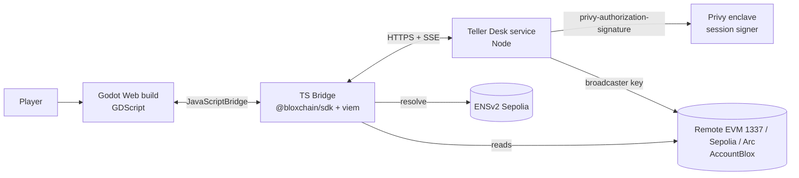

# Branch Zero — Master Plan

> **One line:** Branch Zero is a walkable 3D bank, built in Godot, where every counter, vault door and back-office desk is a real Bloxchain-governed account operation on a public testnet. You do not click "Confirm" in a wallet pop-up; you talk to a teller.

| Field | Value |
|-------|-------|
| Event | [ETHOnline 2026](https://ethglobal.com/events/ethonline2026) — online, async, **Sep 4 – Sep 16, 2026** |
| Track | **Start Fresh** (new project; Bloxchain protocol is a public dependency, not prior work on this project) |
| Repo | `https://github.com/JaCoderX/Branch-Zero` |
| Engine | Godot 4.5.x (GDScript), Web export (single-threaded) |
| Protocol | Bloxchain via the **public** npm packages only: `@bloxchain/sdk` (+ `@bloxchain/contracts` for the account bytecode) |
| Dev chain | **Remote EVM** `1337` (`http://127.0.0.1:8545`) — [REMOTE-EVM.md](./REMOTE-EVM.md) |
| Primary public chain | Ethereum Sepolia (ENSv2 beta and Uniswap v4 live there; Privy supports it) |
| Secondary chain | Arc Testnet (chain id `5042002`, USDC-as-gas) — "Arc wing" of the bank |
| Sponsor targets | **Privy** (B2B financial product), **ENS** (Best Use of ENSv2), **Uniswap v4 FX** (S1 — activated while Arc deferred) — Arc kept as deferred wing ([ARC.md](./ARC.md) §5b); see [REFLECTION.md](./REFLECTION.md) § Sponsor matrix |
| Planning date | Sunday Sep 6, 2026 — **10 build days** remain |

---

## 0. How to read this folder

| Doc | What it answers |
|-----|-----------------|
| **PLAN.md** (this file) | What we build, in what order, with what gates, and what "done" means |
| [DEV-LOOP.md](./DEV-LOOP.md) | Craft / lab / product split; construction units U0–U7; OBJ-2026-0004 |
| [REMOTE-EVM.md](./REMOTE-EVM.md) | Default local chain (Nethermind `1337`) — use before Sepolia |
| [GAME-DESIGN.md](./GAME-DESIGN.md) | The player experience: core loop, protocol-to-game mapping, quests, HUD |
| [WORLD-3D-ENVIRONMENT.md](./WORLD-3D-ENVIRONMENT.md) | The bank building: zones, layout, art direction, asset pipeline, perf budget |
| [NPCS.md](./NPCS.md) | Every NPC: which on-chain role it embodies, dialogue, state machine |
| [ARCHITECTURE.md](./ARCHITECTURE.md) | System layers, Godot ↔ JS bridge, Teller Desk service, sequence diagrams, repo layout |
| [BLOXCHAIN-INTEGRATION.md](./BLOXCHAIN-INTEGRATION.md) | Exactly how the public SDK is used: provisioning, guard config, the two transaction lanes |
| [PRIVY.md](./PRIVY.md) · [ENS.md](./ENS.md) · [ARC.md](./ARC.md) · [UNISWAP.md](./UNISWAP.md) | Per-sponsor integration, prize criteria, and the minimal proof each judge needs to see |
| [GODOT.md](./GODOT.md) | Engine conventions, web export settings, JavaScriptBridge contract, testing |
| [SECURITY-AND-KEYS.md](./SECURITY-AND-KEYS.md) | Key custody, env layout, threat model, testnet-only posture |
| [DEMO-SCRIPT.md](./DEMO-SCRIPT.md) | Storyboard for the demo video, live-demo runbook, submission checklist |
| [REFLECTION.md](./REFLECTION.md) | Design review, sponsor decision matrix, kill tests, open questions |

Ground rule for all docs: **derive protocol behavior from the public Bloxchain docs and SDK types, never invent semantics.** Where something is not yet verified on-chain, it is marked `VERIFY` and has a kill test in § 7.

---

## 1. Vision and thesis

### 1.1 The pitch

Crypto UX asks the user to be their own compliance department: read hex, trust a pop-up, hope the signer is honest. Real banks solved this centuries ago with **physical process**: you walk to a counter, a teller acts on your behalf under rules, big movements go through a vault with a delay, and a manager signs off.

Bloxchain already encodes exactly that process on-chain: **roles** (owner / broadcaster / recovery / runtime roles), **time-locked workflows**, **meta-transactions** (sign here, execute there), and **guards** (whitelisted targets and function schemas). Branch Zero makes that state machine **walkable**. The teller is the broadcaster. The vault door is the timelock. The manager's office is the approval step. The security officer is the recovery role.

### 1.2 What makes it novel (and defensible to judges)

1. **The wallet never interrupts the game.** Login is a Privy embedded wallet; the player grants a **scoped session signer** once at the "Account Opening" desk. Afterwards every EIP-712 meta-transaction is signed by the enclave under policy — the player experiences a teller stamping a slip, not a MetaMask modal.
2. **Two lanes, one account.** Routine payments are instant (`requestAndApproveExecution`), high-value wires are time-locked (`executeWithTimeLock` → vault countdown → `approveTimeLockExecution`). Both lanes are pure Bloxchain; the game just renders them.
3. **Identity is ENSv2, not a nickname table.** Customers and staff are subnames under `branchzero.eth` on Sepolia; roles and limits are text records; delegated edit rights use Enhanced Access Control. Pay-by-name is a real resolution, not a lookup table.
4. **A stablecoin bank on a stablecoin chain.** The Arc wing runs the same account contract with USDC as gas, showing the account pattern is chain-portable.

### 1.3 What it is not

- Not a web admin dashboard, not a wallet, not a DeFi protocol. It is a **teaching machine wrapped as a game**.
- Not mainnet. Everything is testnet; keys are throwaway; see [SECURITY-AND-KEYS.md](./SECURITY-AND-KEYS.md).
- Not a fork of Bloxchain. We consume the public SDK and deploy the published example account (`AccountBlox`) unchanged.

---

## 2. Hard constraints

| # | Constraint | Consequence |
|---|-----------|-------------|
| C1 | **Public `@bloxchain/sdk` (+ viem) only for product runtime.** No `@bloxchain/contracts` in Branch Zero. Bootstrap/clone via protocol CopyBlox scripts or existing lab addresses. No unpublished packages, no path deps for runtime, no copied protocol Solidity. | All protocol calls go through SDK wrappers. Missing helpers → write in `apps/web` / `apps/teller-desk` on top of the public API. |
| C2 | **Godot 4.x, GDScript, Web export.** C# is not supported on Web in Godot 4. | All wallet / chain logic lives in TypeScript around the canvas; GDScript only talks to `window.BranchZero` via `JavaScriptBridge`. |
| C3 | **Single-threaded Web export.** Threaded export needs COOP/COEP `require-corp`, which blocks third-party iframes — Privy's embedded wallet is an iframe. | Export preset: Thread Support **off**. Keep scenes light (see perf budget in WORLD doc). |
| C4 | **ENSv2 is Sepolia-only (beta).** | Sepolia is the primary chain. Arc gets a second deployment; ENS resolution is read from Sepolia regardless of which "wing" the player is in. |
| C5 | **Hackathon rules.** New code during the event, public repo, demo video, AI-tool disclosure where required, sponsor-specific deliverables (Uniswap `FEEDBACK.md`, Arc architecture diagram, ENS "central not cosmetic", Privy "at least one control"). | Submission checklist in [DEMO-SCRIPT.md](./DEMO-SCRIPT.md). |
| C6 | **10 build days, small team.** | Ruthless scope ladder (§ 4). Anything not in MVP has a stated fallback. |
| C7 | **Remote EVM first; do not wipe.** Local execution is particle-tool-box Remote EVM (`1337`, ~**20M** gas ceiling). | Iterate without faucet. No `docker compose down -v` unless principal orders it. Sepolia/Arc for ENS / Uniswap / Arc-compat / judge receipts. See [REMOTE-EVM.md](./REMOTE-EVM.md). |

---

## 3. Scope ladder

Everything is ordered so that at any point after Day 3 we can stop and still have a coherent, demoable, judgeable project.

### 3.1 MVP (must ship — Days 1–5)

**M1. Account Opening desk (onboarding)**
- Privy login (email / social / passkey) → embedded EVM wallet.
- Deploy one `AccountBlox` per player on Sepolia (owner = player's Privy wallet, broadcaster = Teller Desk hot wallet, recovery = Security Officer wallet, timelock = 120 s for demo), initialised atomically.
- Player grants a **Privy session signer** with a policy scoped to `eth_signTypedData_v4` on the Bloxchain EIP-712 domain for their account address.
- Guard configuration batch (owner signs via session signer, broadcaster executes): register `transfer(address,uint256)` schema, whitelist the demo USDC token for that selector, grant owner `EXECUTE_META_REQUEST_AND_APPROVE` / time-delay actions as needed. Details in [BLOXCHAIN-INTEGRATION.md](./BLOXCHAIN-INTEGRATION.md).

**M2. Counter — routine payment (Lane A, instant)**
- Player asks the Teller to pay `N` USDC to a recipient.
- Bridge builds `TxParams` + `MetaTxParams`, calls `generateUnsignedMetaTransactionForNew` on the player's account, signs the EIP-712 payload through the Privy session signer (server side, no pop-up), Teller Desk broadcasts `requestAndApproveExecution`.
- Teller NPC animates "stamp → print receipt"; receipt shows tx hash + explorer link.

**M3. Vault — high-value wire (Lane B, time-locked)**
- Amount above the branch limit → Teller refuses instant lane and routes to the Vault.
- `executeWithTimeLock` creates a PENDING record; vault door shows a countdown driven by `getTransaction(txId).releaseTime` (read from chain, not a local timer).
- After release: player (owner) or Branch Manager approves → `approveTimeLockExecution`. Player can also cancel at the Manager's desk → `cancelTimeLockExecution`.

**M4. Ledger board**
- Lobby display reads `getPendingTransactions()` and recent `getTransactionHistory()` and renders status (PENDING / COMPLETED / CANCELLED) as departure-board rows.

**M5. Playable 3D bank shell**
- One interior scene: lobby, 2 counters, vault antechamber + vault door, manager's office, account-opening desk, name desk (placeholder until ENS ships). Third-person controller, interaction prompts, dialogue UI.

### 3.2 Target (should ship — Days 6–8)

**T1. ENSv2 Name Desk** — subname registry under `branchzero.eth` (Sepolia): `alice.branchzero.eth` → player's `AccountBlox`; staff subnames with role text records; delegated record edit via Enhanced Access Control; pay-by-name at the counter. See [ENS.md](./ENS.md).

**T2. Arc wing** — same `AccountBlox` deployment on Arc Testnet; USDC (native) payments; the elevator switches wings (chain). See [ARC.md](./ARC.md).

**T3. Branch Manager runtime role** — `RuntimeRBAC` role `BRANCH_MANAGER` with approve/cancel permission on the wire selector, assigned to a second Privy user or a demo wallet; manager NPC executes approvals.

### 3.3 Stretch (nice — Day 9 only if T1–T3 are green)

**S1. FX Desk (Uniswap v4 on Sepolia)** — guarded swap via Universal Router as a whitelisted target. See [UNISWAP.md](./UNISWAP.md). If shipped, submit to Uniswap with `FEEDBACK.md`.
**S2. Security Officer recovery flow** — recovery role triggers `transferOwnershipRequest` → time-locked → new owner.
**S3. Polish** — ambient audio, animated crowd NPCs, day/night, achievements.

### 3.4 Explicit non-goals

Mainnet, real money, custom Solidity (beyond deploy scripts), mobile export, multiplayer, any package outside public `@bloxchain/sdk` / `@bloxchain/contracts` on npm.

---

## 4. Ten-day schedule

Dates are inclusive. Each day ends with a **commit** plus a local progress note / capture under `docs/progress/` (gitignored — for Continuity-style "show your work" and final video B-roll, not the public repo).

| Day | Date | Theme | Deliverable (Definition of Done) | Gate |
|-----|------|-------|----------------------------------|------|
| 1 | Sun Sep 6 | Spike & kill tests | Repo scaffold (`apps/game`, `apps/web`, `apps/teller-desk`, `packages/shared`). Godot 4.5 web export with a cube runs in browser single-threaded. `JavaScriptBridge` round-trip proven. `@bloxchain/sdk` installed; `AccountBlox` deployed on **Remote EVM 1337**; `owner()` read back. **Kill tests K1 + K4** logged in `REFLECTION.md`. | G1: K1 and K4 pass or have a fallback chosen |
| 2 | Mon Sep 7 | Signing lane | Privy app created; login in the HTML shell; session signer with policy added; server-side `eth_signTypedData_v4` of a Bloxchain meta-tx digest verified against `MetaTransactionSigner.verifySignature` path (recover == signer). Guard config batch executes. | G2: one `requestAndApproveExecution` USDC transfer lands on Sepolia with **zero** browser pop-ups after delegation |
| 3 | Tue Sep 8 | Time-lock lane | `executeWithTimeLock` → PENDING → wait → `approveTimeLockExecution`; cancel path; `getTransaction` polling; error decode via `decodeRevertReason`. Teller Desk service exposes REST + SSE for tx status. | G3: both lanes green in a headless script and via bridge from a stub UI |
| 4 | Wed Sep 9 | Bank shell (greybox) | Greybox interior with all zones, player controller, interact prompts, dialogue box, Teller + Vault + Manager interactions wired to bridge. Ledger board reads chain. | G4: end-to-end M1–M4 playable in browser, ugly |
| 5 | Thu Sep 10 | MVP freeze | Bug bash, error UX (revert reasons as teller lines), reconnect handling, loading screen, first art pass (materials, lighting, props). Tag `v0.1-mvp`. **Sponsor slot 3 decision (Arc vs Uniswap) locked.** | G5: MVP demo recorded (rough) |
| 6 | Fri Sep 11 | ENSv2 | Parent name on Sepolia, `UserRegistry` + `PermissionedResolver` deployed via ENSv2 contracts, subname mint at Name Desk, role text records, EAC delegation to Teller for one record key, pay-by-name at counter. | G6: judge can type `bob.branchzero.eth` at the counter and the payment resolves live |
| 7 | Sat Sep 12 | Arc wing + Manager role | `AccountBlox` + definitions on Arc Testnet; elevator switches chain; native USDC lane A/B on Arc. `BRANCH_MANAGER` runtime role via `roleConfigBatchRequestAndApprove`; manager approval path. Architecture diagram exported (Arc requirement). | G7: same player walks both wings; Arc explorer links in receipts |
| 8 | Sun Sep 13 | Art & feel | Final art pass, NPC animations, audio, HUD polish, tutorial quest, achievements stub. Performance pass (60 fps target on integrated GPU, single-thread). | G8: "would I show this to a stranger" review |
| 9 | Mon Sep 14 | Stretch or harden | If G6–G7 green: FX Desk (Uniswap). Else: harden, write docs, README with code-line pointers, `FEEDBACK.md` if Uniswap shipped. | G9: feature freeze 20:00 local |
| 10 | Tue Sep 15 | Ship | Demo video (≤ 4 min; ≤ 3 min if sponsor page says so), live deploy (static host with correct headers), ETHGlobal submission form, sponsor-specific forms. Buffer for Sep 16 deadline (check exact hour/timezone on the event page). | G10: submitted |

**Daily rhythm:** 09:00 15-min plan; 13:00 integration merge; 20:00 capture + log. No new dependencies after Day 7 without a note in `REFLECTION.md`.

---

## 5. Team roles (works for 1–3 people)

| Hat | Owns | Primary docs |
|-----|------|-------------|
| **Protocol / bridge** | `apps/web`, `apps/teller-desk`, deploy scripts, Privy, ENS, Arc contracts | BLOXCHAIN-INTEGRATION, PRIVY, ENS, ARC, SECURITY |
| **Game** | `apps/game` Godot project, scenes, NPCs, HUD, dialogue, web export shell | GAME-DESIGN, WORLD, NPCS, GODOT |
| **Producer / narrative** | schedule, demo video, README, submission forms, sponsor compliance | PLAN, DEMO-SCRIPT, REFLECTION |

Solo? Days 1–3 wear the protocol hat, Days 4–5 the game hat, then alternate.

---

## 6. Architecture in one paragraph

A **Godot Web build** runs inside a custom HTML shell. The shell also mounts a thin **React overlay** for Privy login and status toasts. GDScript calls `JavaScriptBridge.get_interface("BranchZero")` to invoke a small **TypeScript bridge** (`apps/web`) that wraps `@bloxchain/sdk` + viem for reads and builds unsigned meta-transactions. Signing and broadcasting happen in the **Teller Desk service** (`apps/teller-desk`, Node): it holds the Privy authorization key (to request enclave signatures from the player's session-signer-enabled wallet) and the **broadcaster** hot wallet (to execute). State flows back via SSE so the game reacts to PENDING → COMPLETED. Full diagrams in [ARCHITECTURE.md](./ARCHITECTURE.md).

---

## 7. Kill tests and fallbacks (run on Day 1–2)

| ID | Question | Test | Fallback if it fails |
|----|----------|------|----------------------|
| K1 | Can Godot 4.5 single-threaded web export call into a JS module and receive callbacks? | Cube scene, `JavaScriptBridge.create_callback`, echo a promise result | Use `JavaScriptBridge.eval` polling on a global; or desktop build + local HTTP bridge for the video |
| K2 | Does a Privy session signer sign `eth_signTypedData_v4` for the Bloxchain domain such that `recoverAddress(digest)` == wallet address? | Sign an unsigned meta-tx from `generateUnsignedMetaTransactionForNew`; run the SDK verify path | Sign with Privy **client-side** `signTypedData` (one pop-up per action) — still Privy, still eligible; narrative becomes "teller asks you to sign the slip" |
| K3 | Does `AccountBlox` + definition libraries deploy and initialise on **Arc Testnet** (EVM version compat with Solidity 0.8.35 output)? | Deploy script against `https://rpc.testnet.arc.io` with faucet USDC | Drop Arc, promote Uniswap to slot 3 (both documented); Arc wing becomes "under construction" set dressing |
| K4 | Are `GuardControllerDefinitions` / `RuntimeRBACDefinitions` published for Sepolia in `@bloxchain/contracts` (`deployed-addresses.json`)? **Local bar:** can we deploy `AccountBlox` from those artifacts onto **Remote EVM 1337** and read `owner()`? | Inspect installed package; run ENG-2026-0005 / U0 deploy script against `http://127.0.0.1:8545` | Deploy the definition libraries ourselves from package artifacts (they are libraries with pure/view functions; cheap). If Remote EVM rejects bytecode: Anvil fork, then Sepolia |
| K5 | Can a Privy policy constrain typed-data signing to our domain/verifyingContract? | Create policy in dashboard; attempt an out-of-scope sign; expect denial | Scope by method only (`eth_signTypedData_v4`) and document the residual risk; the on-chain guards remain the real control |
| K6 | ENSv2 Sepolia: can we register a `UserRegistry` under a name we own and mint subnames in a script? | Follow contract-developer tutorial; mint `test.branchzero.eth` | Use `.eth` name text records + wildcard resolution only; still ENSv2, weaker "central" claim |
| K7 | Uniswap v4 Universal Router on Sepolia callable from a contract account via `GuardController` (Permit2 approvals as guarded calls)? — **2026-09-08: YES.** `0xd98efc64…`, three guarded meta-transactions, then one per repeat swap | Script three guarded calls: `approve(Permit2)`, `Permit2.approve(router)`, `router.execute` | Native-input swap only, or drop S1 — not needed |

Results are recorded in [REFLECTION.md](./REFLECTION.md) § Kill test log.

---

## 8. Definition of "done" for the submission

- [ ] Public repo, MIT or MPL-2.0 licence file, README with: 60-second pitch, architecture diagram, **exact file:line pointers** for each sponsor integration, run instructions, AI-tools disclosure.
- [ ] Live web build reachable over HTTPS (static host; single-thread export needs no special headers).
- [ ] Demo video (see [DEMO-SCRIPT.md](./DEMO-SCRIPT.md)) showing: login → account opening → instant payment (no pop-up) → time-locked wire with vault countdown → approval → ledger board; plus ENS pay-by-name and the Arc wing if shipped.
- [ ] Sponsor forms: Privy (state which prize: B2B financial product), ENS (Sepolia, ENSv2 features listed), Arc (architecture diagram + which bounty), **Uniswap — S1 shipped 2026-09-08, so this one is owed**: `FEEDBACK.md` + <https://developers.uniswap.org/hackathon-feedback>.
- [ ] `docs/` up to date; `REFLECTION.md` decision log closed.

---

## 9. Decision log

| Date | Decision | Why | Revisit |
|------|----------|-----|---------|
| Sep 6 | Sepolia primary, Arc secondary | ENSv2 and Uniswap v4 test deployments live on Sepolia; Arc adds the stablecoin story without moving identity | Day 5 gate |
| Sep 6 | Sponsor trio = Privy + ENS + Arc; Uniswap as swap-in | Largest thematic fit and pool; Uniswap needs Permit2 choreography that is risky for a contract account | Day 5 gate (K3, K7) |
| Sep 6 | Session signer (server-side enclave signing) over client-side signing | Delivers the "no pop-up" thesis; fallback exists (K2) | Day 2 |
| Sep 6 | One `AccountBlox` per player, deployed at onboarding | Matches Bloxchain's account pattern and the "open an account" narrative; keeps per-player isolation | — |
| Sep 6 | Demo timelock 120 s | Long enough to walk to the vault and see a countdown; short enough for a 4-min video | Day 8 |
| Sep 6 | Single-threaded Godot export | COOP/COEP `require-corp` would break the Privy iframe | — |
| Sep 6 | Remote EVM (`1337`) is the default **dev** chain | Kill tests and Teller Desk iteration must not depend on Sepolia faucet; EIP-712 `chainId` isolates signatures | If Docker down: name blocker; do not use Ganache keys on public nets |
| Sep 6 | Craft/lab bindings: OBJ-2026-0004 · ENG-2026-0003…0008 | Construction units in [DEV-LOOP.md](./DEV-LOOP.md); ENG trees are never merged into this repo | — |

---

## 10. Open questions for the human

1. Team size and who holds which hat (affects whether Day 9 stretch is realistic).
2. Do you own (or will you register) a Sepolia `.eth` name to act as `branchzero.eth`? Registration on Sepolia ENSv2 takes a commit/reveal wait — do it on Day 1.
3. Confirm the interpretation of "public Bloxchain SDK only": `@bloxchain/sdk` **and** `@bloxchain/contracts` (both on the public npm registry) are the only protocol dependencies; nothing unpublished, no local path deps.
4. Preferred hosting for the web build (GitHub Pages is fine for single-thread export; Cloudflare Pages if we want custom headers later).
5. Is Remote EVM already up on this machine / Tailscale? If not, who starts `docker compose` in particle-tool-box `Docker Apps/Remote EVM`?
